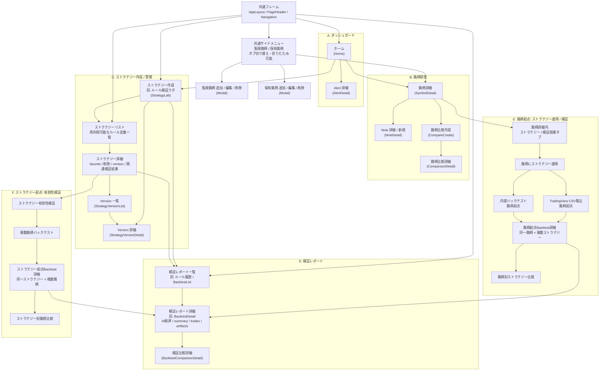
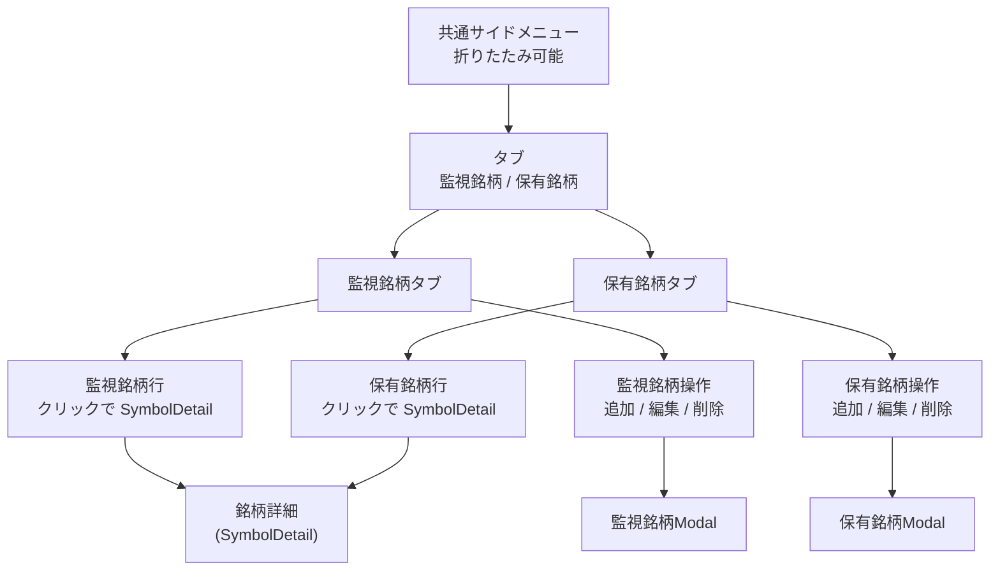
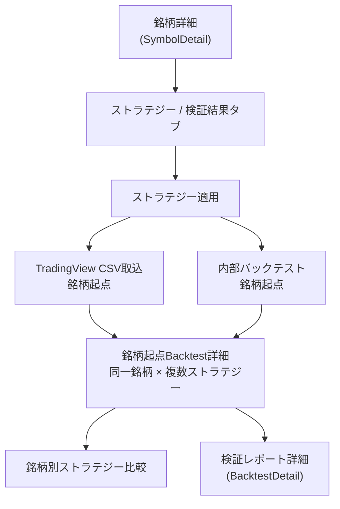
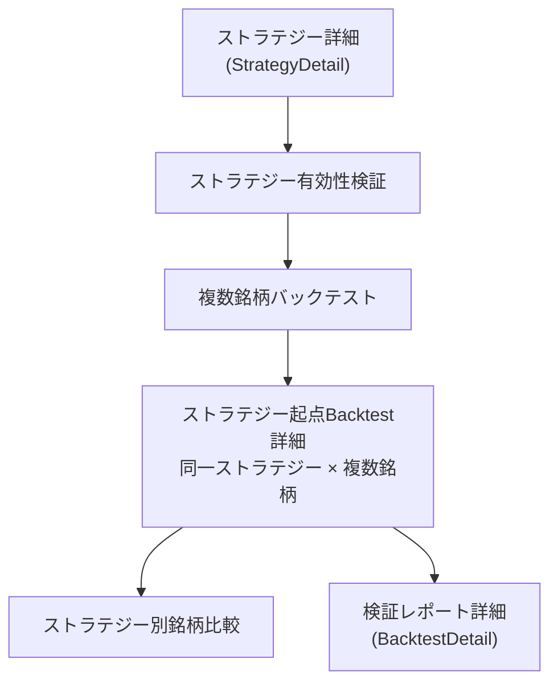

# 北極星 画面導線・IA再整理（P3）

更新日: 2026-05-09

## 1. 目的

- Tailwind 画面移行前に、画面導線 / IA / ナビゲーション方針を整理する
- 現行画面の単純な Tailwind 化ではなく、今後の画面構造に合わせて移行する
- Mermaid による編集可能な画面遷移図を正本にする

## 2. 重要な設計判断

- 共通サイドメニューを導入する
- 監視銘柄 / 保有銘柄はタブ切り替えで表示する
- サイドメニューは折りたたみ可能にする
- 監視銘柄 / 保有銘柄の追加・編集・削除は、専用管理画面ではなくモーダルで行う
- `WatchlistManage` / `PositionsManage` は、将来的に主要導線から外す
- `StrategyDetail` は `BacktestDetail` を置き換えない
- `BacktestList` は `StrategyList` に単純改名しない
- `BacktestList` / `BacktestDetail` は「検証レポート一覧 / 詳細」として継続・発展させる
- `StrategyList` / `StrategyDetail` は「再利用可能なストラテジー定義」の管理画面として新設する想定
- 銘柄起点 Backtest 詳細と、ストラテジー起点 Backtest 詳細は別画面概念として扱う
- CSV取込 / 内部バックテストは、最終的には銘柄詳細側へ寄せる
- `StrategyLab` は作成・生成側に寄せる
- ストラテジー起点の導線は、ルール自体の有効性検証として残す

## 3. 現行導線の整理

現行 route は [App.tsx](G:\Projects\hokkyokusei\frontend\src\App.tsx) を正とし、次の画面で構成される。

- `Home`
- `AlertDetail`
- `SymbolDetail`
- `NoteDetail`
- `CompareCreate`
- `ComparisonDetail`
- `StrategyLab`
- `StrategyVersionList`
- `StrategyVersionDetail`
- `WatchlistManage`
- `PositionsManage`
- `BacktestList`
- `BacktestDetail`
- `BacktestComparisonDetail`

現行の役割整理:

- `Home` は入口画面であり、日次確認、マーケット概況、AIデイリーサマリー、最新アラート、注目イベントを優先表示する
- `SymbolDetail` は銘柄研究の中心であり、snapshot / references / AI summary / recent alerts / note / comparison 導線を持つ
- `StrategyLab` は自然言語から Pine を生成し、version と backtest 生成に接続する作成画面である
- `StrategyVersionList` / `StrategyVersionDetail` は version 管理と詳細確認の画面である
- `BacktestList` / `BacktestDetail` は AI 総評を含む検証レポート導線として現在も重要であり、改修後も残す必要がある
- `BacktestComparisonDetail` は検証結果比較の詳細画面として扱う
- `WatchlistManage` / `PositionsManage` は現行では管理画面だが、改修後は主要導線から外し、モーダル操作へ寄せる方針とする

## 4. 改修後IA 全体図

## 5. 共通サイドメニュー方針

- 共通サイドメニューは `AppLayout` 配下に置く
- 一覧対象は「監視銘柄 / 保有銘柄」の 2 系統に絞る
- 表示はタブ切り替えで行い、画面幅や集中作業に合わせて折りたたみ可能にする
- 一覧の責務は「素早い銘柄移動」であり、詳細 CRUD は持たせすぎない
- 追加 / 編集 / 削除はサイドメニュー内で完結させず、モーダルで行う
- 現行の `WatchlistManage` / `PositionsManage` は移行期間中のみ残し、最終的には主要導線から外す
- 2026-05-09 時点で `SideRail` の watchlist / positions CRUD は最小モーダル化済み
- 既存 `/watchlist` `/positions` は移行期の補助画面として残し、`SideRail` 内では `詳細管理` 導線として扱う

### 共通サイドメニュー図

## 6. 監視銘柄 / 保有銘柄のUI方針

- 2026-05-09 時点で、`Home` 本体から watchlist / positions の詳細一覧は外し、一覧確認は `SideRail` に寄せた
- `Home` 上の watchlist / positions 情報は詳細一覧ではなく、日次確認導線の補助説明に留める
- 改修後の主要移動は、`Home` だけでなく共通サイドメニューからも可能にする
- 監視銘柄 / 保有銘柄の CRUD はモーダル中心にし、専用管理画面への依存を下げる
- 既存 API / DB の正本性は維持し、UI だけを主要導線から再整理する
- `SideRail` 用データ取得は PoC 段階では `GET /api/home` を再利用し、`Home` 本体との二重 fetch 最適化は後続とする
- CRUD 後の再取得は `GET /api/home` / `GET /api/watchlist-items` / `GET /api/positions` 単位で行い、再取得最適化は後続とする

## 7. ストラテジー作成・管理・検証レポート・銘柄別適用の分離

### 7.1 ストラテジー作成 / 管理

- `StrategyLab` は作成・生成に寄せる
- 役割は「自然言語入力」「Pine 生成」「version 作成」の入口である
- `StrategyList` / `StrategyDetail` は、再利用可能なストラテジー定義を管理する新設概念とする

### 7.2 検証レポート

- `BacktestList` は `StrategyList` に単純改名しない
- `BacktestList` / `BacktestDetail` は、検証レポート一覧 / 詳細として残す
- `BacktestDetail` は AI 総評 / summary / trades / artifacts を含むレポート詳細として継続・発展させる

### 7.3 銘柄起点の適用 / 検証

- 銘柄詳細内に「ストラテジー / 検証結果」系のタブを持たせる想定とする
- CSV 取込と内部バックテストは、最終的に銘柄詳細側へ寄せる
- 同一銘柄に複数ストラテジーを適用した結果比較を別画面概念として持つ

### 銘柄起点フロー図

### 7.4 ストラテジー起点の有効性検証

- ストラテジー自体の有効性検証は残す
- 同一ストラテジーを複数銘柄で比較する backtest 詳細は、銘柄起点の backtest 詳細と別概念にする

### ストラテジー起点フロー図

## 8. 現行 BacktestList / BacktestDetail の扱い

- `BacktestList` は「検証レポート一覧」として継続する
- `BacktestDetail` は「検証レポート詳細」として継続する
- `StrategyDetail` は `BacktestDetail` を置き換えない
- `BacktestComparisonDetail` も検証結果比較の文脈で残す
- 画面名や IA は将来的に見直してよいが、役割としては「レポート導線」を維持する

## 9. 実装順序

推奨順:

1. Tailwind 設定追加のみ、または Tailwind 設定追加 + 最小 global CSS 整理
2. 画面導線 / IA / ナビゲーション方針整理
3. `AppLayout` / `PageHeader` / `Navigation` / `TextLink` の最小土台追加
4. `Home` の最小移行
5. `SymbolDetail` へ拡張
6. `Watchlist / Positions` をモーダル中心導線へ寄せる
7. `StrategyList` / `StrategyDetail` など新しいストラテジー管理導線を検討
8. `StrategyLab` / `BacktestDetail` / `ComparisonDetail` / `StrategyVersionDetail` は後続判断

2026-05-09 時点の判断:

- 1 は完了済み
- 2 も本 docs で正本化済み
- `AppLayout` / `PageHeader` / `Navigation` / `TextLink` の最小土台は `Home` / `SymbolDetail` にだけ適用済み
- `SideRail` の最小 PoC は `Home` / `SymbolDetail` にだけ適用済み
- `SideRail` は `/api/home` の `watchlist_symbols` / `positions` をそのまま再利用する
- PoC では `Home` 本体と `SideRail` が個別に `/api/home` を読むため、`Home` 上では二重 fetch が発生する。最適化は後続とする
- `SideRail` では `監視` / `保有` のタブ切り替えと折りたたみだけを実装済み
- `監視銘柄を追加` / `保有銘柄を追加` は既存 `/watchlist` `/positions` への補助導線であり、CRUD モーダルは未実装
- `StrategyList` 系 route、監視 / 保有 CRUD モーダルは未実装
- 次は `Home` の最小移行、または `SideRail` の CRUD モーダル化をどちらから進めるかを判断する

## 10. テスト方針への影響

- [docs/45](G:\Projects\hokkyokusei\docs\45.北極星 browser-based E2E導入方針（P3）.md) の browser-based E2E 方針を維持する
- 既存 `Home → SymbolDetail` Playwright PoC は維持する
- 導線変更で URL や主要リンクが変わる場合のみ、PoC を必要最小限で調整する
- Tailwind class / layout / spacing 依存の test は増やさない
- browser E2E の 2 本目以降は、導線変更後の安定構造に合わせて判断する

## 11. 今回やらないこと

- Tailwind 画面移行
- UI 実装変更
- route 追加
- API shape 変更
- DB 構造変更
- backend 改修
- Playwright spec 追加
- 画像生成や画像ファイル追加

## 12. 結論

- Tailwind 化は「全画面を先に置換する作業」ではなく、導線変更とセットで段階的に進める
- 次の実装判断は `docs/47` を正本として行う
- 最初に触るべき画面は依然として `Home` だが、先に共通ナビゲーションと IA を固める
- `BacktestList` / `BacktestDetail` はレポート導線として残し、`StrategyList` / `StrategyDetail` とは分離して考える

## 追記（2026-05-09）

- `SymbolDetail` の最小移行を完了した。
- `現在スナップショット` `最新アラート` `最新AI論点カード` `Research Note` `関連参照情報` の section を最小 Tailwind 化し、TradingView chart / AI論点カード生成 / Research Note 導線 / reference breakdown は維持した。
- 銘柄起点ストラテジー適用 / 検証タブは未実装であり、次候補は銘柄起点ストラテジー適用フロー設計、または `SideRail` の `/api/home` 再取得最適化である。

## 追記（2026-05-09 その2）

- 銘柄起点ストラテジー適用フローの詳細設計は [docs/48.北極星 銘柄起点ストラテジー適用フロー設計（P3）.md](./48.北極星%20銘柄起点ストラテジー適用フロー設計（P3）.md) を正本とする。
- `docs/47` の Mermaid 全体図は IA 全体像の維持に使い、銘柄起点の詳細フロー、Strategy 起点との分離、段階実装順は `docs/48` 側で管理する。

## 追記（2026-05-09 その3）

- `docs/48` の Phase B に従い、`SymbolDetail` に `ストラテジー / 検証結果` section の受け皿を追加した。
- 現時点では準備中表示と既存 `StrategyLab` / `BacktestList` への補助導線のみを持ち、strategy 適用、CSV 取込、内部バックテスト、比較導線は未接続である。

## 追記（2026-05-09 その4）

- `StrategyList` / `StrategyDetail` の詳細設計は [docs/49.北極星 StrategyList・StrategyDetail 画面設計（P3）.md](./49.北極星%20StrategyList・StrategyDetail%20画面設計（P3）.md) を正本とする。
- IA 全体図は `docs/47` に残し、strategy definition 一覧 / 詳細の責務、route 候補、段階実装順は `docs/49` 側で管理する。

## 追記（2026-05-09 その5）

- `StrategyList` / `StrategyDetail` 画面設計の詳細正本は [docs/49.北極星 StrategyList・StrategyDetail 画面設計（P3）.md](./49.北極星%20StrategyList・StrategyDetail%20画面設計（P3）.md) とする。
- 2026-05-09 時点で `/strategies` の placeholder route を追加し、`StrategyLab` と `BacktestList` への補助導線だけを先に可視化した。

## 追記（2026-05-10）

- `/strategies/:strategyId` に `StrategyDetail` placeholder route を追加した。
- ここでは再利用可能な Strategy Definition の詳細受け皿を先に可視化し、version 一覧・`StrategyLab`・`BacktestList` への補助導線のみを表示する。

## 追記（2026-05-10 その7）

- SideRail refresh optimization を完了した。
- Home / SymbolDetail に表示する共通 SideRail は維持しつつ、Home では latest home data を AppLayout 経由で共有する。
- SideRail CRUD 後の refresh は必要な範囲に分け、API shape や IA は変更していない。

## 追記（2026-05-10 その8）

- 共通UI土台の cleanup として `SectionCard` を追加した。
- Home / SymbolDetail の主要 section 表現を小さく共通化し、画面導線や IA は変更していない。
- 次に共通化を進める場合も、画面責務を変えずに段階的に適用する。
