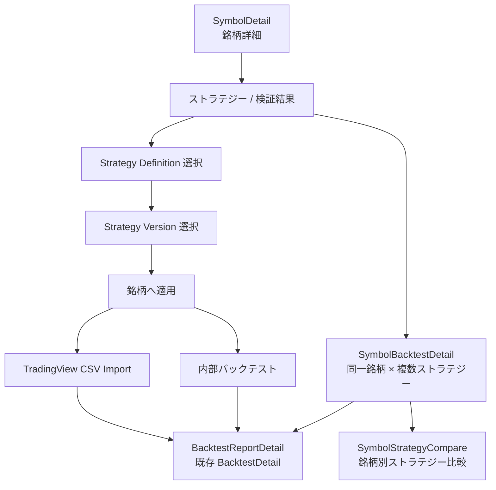
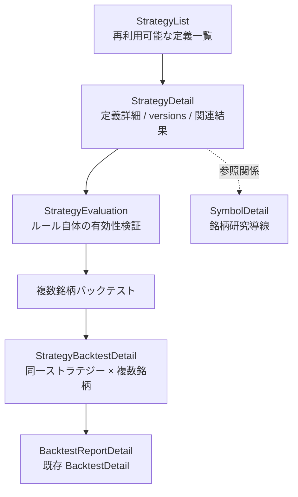

# 北極星 銘柄起点ストラテジー適用フロー設計（P3）

## 1. 目的

- 銘柄詳細からストラテジーを適用し、検証結果を銘柄単位で見られるようにするための設計を固定する。
- 既存 `StrategyLab` / `BacktestList` / `BacktestDetail` を置き換えず、役割を分離する。
- 実装前に画面導線・保存概念・段階実装順を固定する。

## 2. 重要な用語整理

### Strategy Definition

- 再利用可能なストラテジー定義。
- 銘柄には依存しない。
- 将来的な `StrategyList` / `StrategyDetail` の主対象とする。

### Strategy Version

- Pine 生成結果、自然言語仕様、市場、時間足、warnings / assumptions を含む version。
- 現行実装では `StrategyRuleVersion` として保存される。

### Symbol Strategy Application

- 特定銘柄に特定ストラテジー / version を適用する単位。
- 銘柄起点の検証履歴の親概念。
- 現時点では実 DB に専用概念がないため、将来導入候補として扱う。

### Backtest Report

- 既存 `BacktestDetail` に相当する検証レポート。
- AI 総評 / summary / trades / artifacts を含む。
- 銘柄起点・ストラテジー起点のどちらから到達しても、個別レポートの詳細画面として継続する。

### Symbol Backtest Detail

- 銘柄起点で、同一銘柄に対する複数ストラテジー比較を見る画面概念。
- 個別レポートは `BacktestDetail` へリンクする。

### Strategy Backtest Detail

- ストラテジー起点で、同一ストラテジーを複数銘柄に適用した結果を見る画面概念。
- `SymbolBacktestDetail` とは別概念として扱う。

## 3. 画面構成案

### SymbolDetail

- 既存 section は維持する。
- 新設予定:
  - `ストラテジー / 検証結果` タブまたは section
- 表示するもの:
  - この銘柄に適用済みのストラテジー一覧
  - 最新検証結果
  - CSV 取込導線
  - 内部バックテスト導線
  - 検証レポート詳細へのリンク
  - 銘柄別ストラテジー比較へのリンク

### Strategy Apply Modal / Page

- `SymbolDetail` から起動する。
- 既存 `StrategyList` / `StrategyVersion` から選択する想定。
- まだ新 route にするか modal にするかは最終決定しない。
- 初期実装では modal の方が低リスクだが、version 選択量や比較導線が増える場合は専用 page の方が拡張しやすい。

### SymbolBacktestDetail

- 銘柄起点。
- 同一銘柄 × 複数ストラテジーの比較を見る。
- `BacktestDetail` とは別画面概念。
- ただし個別検証レポートの閲覧は `BacktestDetail` を使う。

### BacktestDetail

- 検証レポート詳細として継続する。
- AI 総評 / summary / trades / artifacts を保持する。
- `SymbolBacktestDetail` に吸収しない。

### StrategyDetail

- ストラテジー定義管理の画面概念。
- favorite / delete / versions / 関連検証結果を扱う。
- `BacktestDetail` とは役割を分ける。

## 4. Mermaid フロー図

### 銘柄起点ストラテジー適用フロー詳細

### Strategy 起点との分離図

## 5. CSV取込の扱い

- 既存 TradingView CSV import は残す。
- 銘柄起点では、対象 symbol が `SymbolDetail` から決まっている状態で CSV を取り込む。
- CSV import は `BacktestReport` を生成または既存 application に紐付ける。
- 現行 `BacktestDetail` の AI 総評は維持する。
- 対応 CSV 形式や import 制約は [docs/34.北極星 TradingView CSV import 運用手順（MVP）.md](./34.北極星%20TradingView%20CSV%20import%20運用手順（MVP）.md) を正本とし、設計上も矛盾させない。

## 6. 内部バックテストの扱い

- `engine_actual` / `engine_estimated` の既存整理を壊さない。
- 銘柄起点内部バックテストでは、symbol が固定された状態で strategy version を適用する。
- 結果は `BacktestReport` として保存し、`SymbolBacktestDetail` から参照する。
- 実行エンジンの差分吸収はこの設計タスクでは扱わず、既存 `StrategyVersionDetail` 側の内部バックテスト導線との整合だけ確保する。

## 7. 保存概念

- 現時点の実 DB にない概念は案として扱う。
- 候補:
  - `symbol_strategy_applications`
    - 同一銘柄にどの strategy definition / version を適用したかの親概念
  - `symbol_strategy_application_runs`
    - CSV import / 内部バックテスト / 再実行などの run 単位
  - `backtests` への `symbol_id` / `strategy_version_id` / `application_id` 紐付け

### 比較観点

- `backtests` 拡張だけで進める案
  - 利点:
    - 初期実装が軽い
    - 既存レポート導線を再利用しやすい
  - 注意点:
    - 同一銘柄への繰り返し適用や比較の親概念が曖昧になる

- `application` 系 table を追加する案
  - 利点:
    - 銘柄起点の履歴と run を整理しやすい
    - `SymbolBacktestDetail` の親概念を明確にできる
  - 注意点:
    - DB / API / 既存 backtests との責務分担を明示する必要がある

- 現段階では DB 設計を確定しすぎず、まずは画面導線と概念分離を先に固定する。

## 8. 既存画面との関係

### StrategyLab

- 作成 / 生成側。
- CSV 取込中心の位置づけからは徐々に外す。
- ただし strategy version 作成や Pine 生成の入口としては継続する。

### StrategyVersionDetail

- version 確認 / Pine 再生成 / 内部バックテスト確認側。
- 銘柄起点の適用先ではなく、version 自体の詳細確認として残す。

### BacktestList

- 検証レポート一覧として継続する。
- `SymbolBacktestDetail` や `StrategyBacktestDetail` の親画面にはしない。

### BacktestDetail

- 検証レポート詳細として継続する。
- 銘柄起点・ストラテジー起点の双方から到達する共通レポート詳細。

### BacktestComparisonDetail

- レポート比較として継続する。
- `SymbolStrategyCompare` や strategy 起点比較を置き換えない。

### SymbolDetail

- 銘柄に対するストラテジー適用入口になる。
- 既存の銘柄研究機能を維持したまま、適用 / 検証導線を後続で追加する。

## 9. 実装段階案

### Phase A: docs / route 方針固定

- 今回。

### Phase B: SymbolDetail に `ストラテジー / 検証結果` の空 section 追加

- 表示のみ。
- API なし、または existing data のみで最小表示。
- 2026-05-09 時点で、`SymbolDetail` に空 section と既存 `StrategyLab` / `BacktestList` への補助導線を追加済み。
- strategy 適用、CSV 取込、内部バックテスト、比較導線は未接続のままとする。

### Phase C: StrategyList / StrategyDetail の最小 route 設計

- 再利用可能なストラテジー定義一覧。
- favorite / delete は後続でもよい。
- 画面設計の正本は [docs/49.北極星 StrategyList・StrategyDetail 画面設計（P3）.md](./49.北極星%20StrategyList・StrategyDetail%20画面設計（P3）.md) とする。

### Phase D: SymbolDetail から既存 strategy version を選んで適用する最小 UI

- DB 変更は最小化を優先する。
- 既存 backtest 作成導線との接続を検討する。

### Phase E: 銘柄起点 CSV import

- `SymbolDetail` から CSV import。
- `BacktestReport` 生成。
- `BacktestDetail` へ接続。

### Phase F: 銘柄起点内部バックテスト

- symbol fixed。
- strategy version fixed。
- `engine_actual` へ接続。

### Phase G: SymbolBacktestDetail / SymbolStrategyCompare

- 同一銘柄 × 複数ストラテジー比較。

## 10. 今回やらないこと

- route 追加
- UI 実装
- API 実装
- DB 変更
- backend 改修
- `StrategyList` / `StrategyDetail` 実装
- `SymbolBacktestDetail` 実装
- `BacktestDetail` 改修
- CSV parser 変更
- engine 変更
- Playwright spec 追加

## 11. 次タスク候補

- `StrategyList` placeholder route を追加する
- `StrategyDetail` placeholder route を追加する
- DB 保存概念を docs として整理する
- `SymbolDetail` から既存 strategy version を選ぶ最小 UI を検討する
- `SideRail` の `/api/home` 再取得最適化を先に挟む

## 12. 結論

- 銘柄起点フローは `SymbolDetail` を入口としつつ、個別レポート詳細は既存 `BacktestDetail` を継続利用する。
- `StrategyLab` は作成 / 生成側、`SymbolDetail` は適用 / 検証入口、`BacktestDetail` はレポート詳細、という責務分離を維持する。
- 実装は `SymbolDetail` の空 section 追加から始め、DB 概念や strategy 定義一覧は次段階で固める。

## 追記（2026-05-09 その2）

- Phase C の画面設計を [docs/49.北極星 StrategyList・StrategyDetail 画面設計（P3）.md](./49.北極星%20StrategyList・StrategyDetail%20画面設計（P3）.md) に固定した。
- `docs/49` の Phase B として、`/strategies` に `StrategyList` placeholder route を追加した。
- 次候補は `StrategyDetail` placeholder route、DB 保存概念整理、existing strategy data display、`SymbolDetail` apply flow、`SideRail` の `/api/home` 再取得最適化である。

## 追記（2026-05-10）

- `StrategyDetail` placeholder route を `/strategies/:strategyId` に追加した。
- ただし `SymbolDetail` からの apply flow は未接続であり、現時点では version 一覧・`StrategyLab`・`BacktestList` への補助導線のみを持つ。

## 追記（2026-05-10 その2）

- Strategy 保存概念の整理を [docs/50.北極星 Strategy保存概念整理（P3）.md](./50.北極星%20Strategy保存概念整理（P3）.md) に固定した。
- `SymbolDetail` apply flow は引き続き未実装であり、Symbol Strategy Application / Application Run / Backtest Report の保存関係は docs/50 の段階案に従って後続で確定する。

## 追記（2026-05-10 その3）

- `StrategyList` / `StrategyDetail` に existing strategy data display を追加した。
- `SymbolDetail` apply flow はまだ未接続であり、銘柄起点 application 作成、CSV 取込、内部バックテスト接続は後続タスクとする。

## 追記（2026-05-10 その4）

- `SymbolDetail` apply UI の第一段階として、既存 active strategy / version を選ぶ selection-only UI を追加した。
- Symbol Strategy Application 保存は未実装であり、選択内容は local state のみで保持する。
- CSV 取込、内部バックテスト接続、BacktestReport 作成は未実装のままとする。

## 追記（2026-05-10 その5）

- Symbol Strategy Application の DB / API 設計は [docs/52.北極星 Symbol Strategy Application DB・API設計（P3）.md](./52.北極星%20Symbol%20Strategy%20Application%20DB・API設計（P3）.md) を正本とする。
- `SymbolDetail` apply UI は selection-only のままで、application 保存、CSV取込、内部バックテスト接続は未実装である。
- `BacktestDetail` は application parent ではなく、個別検証レポート詳細として維持する。
## 追記（2026-05-10 その6）

- Symbol Strategy Application の schema / migration を追加した。
- `SymbolDetail` apply UI はまだ selection-only であり、保存処理、CSV取込、内部バックテスト接続は未接続である。
- 次は GET / POST application API と `SymbolDetail` apply 保存処理を docs/52 に従って進める。