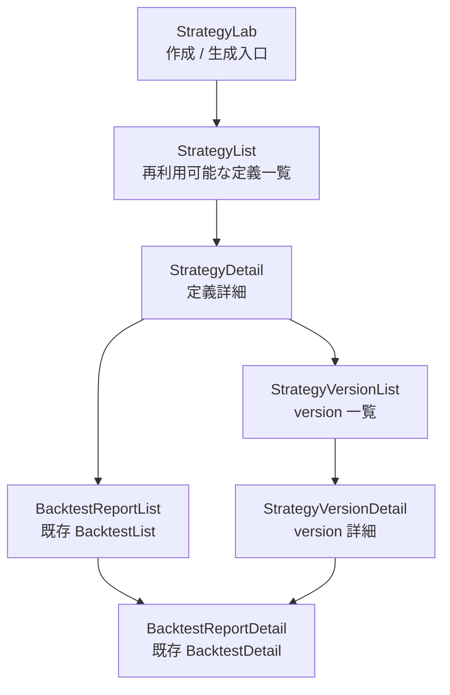
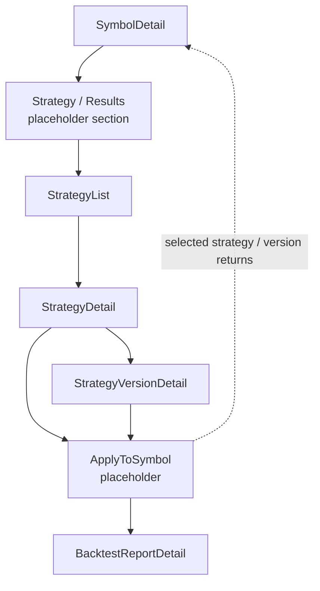

# 北極星 StrategyList・StrategyDetail 画面設計（P3）

## 1. 目的

- 再利用可能な Strategy Definition を一覧・詳細で管理するための画面設計を固定する。
- `StrategyLab` / `StrategyVersionDetail` / `BacktestDetail` を置き換えず、責務を分離する。
- `SymbolDetail` から strategy を選ぶ将来実装の前提を作る。

## 2. 用語と画面責務

### Strategy Definition

- 再利用可能なストラテジー定義。
- 銘柄非依存。
- `StrategyList` / `StrategyDetail` の主対象。

### Strategy Version

- 自然言語ルール、Pine 生成結果、warnings / assumptions、市場、時間足を含む version。
- `StrategyVersionDetail` の主対象。

### Backtest Report

- 個別検証結果。
- AI 総評 / summary / trades / artifacts を含む。
- `BacktestDetail` の主対象。

### Symbol Strategy Application

- 特定銘柄に特定 strategy / version を適用した概念。
- `SymbolDetail` 側で扱う将来概念。

## 3. StrategyList 画面設計

### 想定 route

- `/strategies`

### 目的

- 再利用可能な strategy definition を探す。
- favorite / recently used / created date / updated date などで整理する。
- `SymbolDetail` から選ぶ候補として使える一覧にする。

### 表示候補

- strategy title
- description / natural language summary
- latest version status
- market / timeframe
- favorite
- version count
- related backtest count
- applied symbols count
- updated at
- create strategy 導線
- `StrategyDetail` へのリンク

### 操作候補

- 詳細を開く
- favorite toggle
- delete / archive
- `StrategyLab` で新規作成
- `SymbolDetail` から呼ばれた場合は「この銘柄へ適用」導線

### 今回の固定方針

- favorite / delete は画面設計上の責務として残すが、実装は後続とする。
- 一覧は「再利用可能な strategy definition を探す」ことを主目的とし、`BacktestList` の代替にしない。

## 4. StrategyDetail 画面設計

### 想定 route

- `/strategies/:strategyId`

### 目的

- strategy definition の詳細を見る。
- version 一覧を見る。
- 最新 version / selected version を確認する。
- 関連 backtest report を確認する。
- 適用済み銘柄を確認する。
- `SymbolDetail` への適用導線を持つ。

### 表示候補

- strategy title
- description
- natural language rule summary
- versions list
- latest generated pine summary
- warnings / assumptions summary
- related backtest reports
- applied symbols
- favorite / delete / archive
- `StrategyVersionList` / `StrategyVersionDetail` へのリンク
- `BacktestDetail` へのリンク
- `SymbolDetail` からの apply context がある場合の apply CTA

### 今回の固定方針

- `StrategyDetail` は version の親画面だが、version 詳細そのものは `StrategyVersionDetail` で確認する。
- `BacktestDetail` を吸収せず、関連レポート一覧のハブとして振る舞う。
- `applied symbols` は将来の `Symbol Strategy Application` を表示する領域として予約する。

## 5. 既存画面との関係

### StrategyLab

- 作成 / 生成側。
- 新規 strategy definition / version 作成の入口。
- `StrategyList` / `StrategyDetail` を置き換えない。

### StrategyVersionList

- 特定 strategy の version 一覧。
- `StrategyDetail` 内に吸収するか、既存 route として残すかは後続判断。
- 現行 `/strategies/:strategyId/versions` は互換導線として維持する。

### StrategyVersionDetail

- version 詳細 / Pine / regeneration / internal backtest 確認。
- `StrategyDetail` とは別。
- version 単位の詳細確認として継続する。

### BacktestList

- 検証レポート一覧。
- `StrategyList` ではない。
- strategy definition 一覧に置き換えない。

### BacktestDetail

- 個別検証レポート。
- `StrategyDetail` ではない。
- `StrategyDetail` から related report としてリンクする。

### SymbolDetail

- 銘柄起点の適用入口。
- `StrategyList` / `StrategyDetail` から selected strategy を戻す、または apply flow へ進む将来導線を持つ。

## 6. Mermaid 画面遷移図

### Strategy management flow

### Symbol apply selection flow

## 7. route 方針

- 候補:
  - `/strategies`
  - `/strategies/:strategyId`
  - 既存 `/strategies/:strategyId/versions`
  - 既存 `/strategy-versions/:versionId`

### 実装時の注意

- `wouter` の route 順序に注意する。
- `/strategies/:strategyId/versions` と `/strategies/:strategyId` が競合しないよう、実装時は具体 route を先に置く。
- 今回は route 追加しない。

## 8. API / DB 方針

- 現時点では確定しない。

### API 候補

- 既存 strategies / strategy_versions を読む API を再利用する。
- `StrategyList` 用に strategy definitions + latest version + counts を返す read model API を追加する案。
- `StrategyDetail` 用に strategy definition + versions + related backtests + applied symbols を返す API を追加する案。

### DB 候補

- favorite flag
- archived / deleted state
- strategy usage metadata
- `symbol_strategy_applications` との関連

### 比較観点

- 一覧・詳細で必要な counts を既存 table 集約だけで返せるか。
- favorite / archive を `strategy_rules` に持つか、別メタデータに切るか。
- `applied symbols` を `symbol_strategy_applications` 親概念で管理するか。

### 今回の固定方針

- DB 設計を確定しすぎない。
- ただし favorite / delete / applied symbols を後続で扱えるように、画面責務だけ先に固定する。

## 9. 実装段階案

### Phase A: docs / route 方針固定

- 今回。

### Phase B: StrategyList 空画面 / placeholder route

- `/strategies`
- 既存データがなくても「準備中」表示。
- `StrategyLab` への導線を持つ。

### Phase C: StrategyDetail placeholder route

- `/strategies/:strategyId`
- versions link / backtests link の受け皿。

### Phase D: 既存 strategy data を表示

- existing API or minimal API
- version count / latest version

### Phase E: SymbolDetail apply flow と接続

- `SymbolDetail` から `StrategyList` を開く。
- selected strategy / version を戻す、または apply modal へ進む。

### Phase F: favorite / archive / delete

- API / DB 方針確定後。

### Phase G: related backtest reports / applied symbols

- `BacktestDetail` / `SymbolDetail` と接続。

## 10. 今回やらないこと

- route 追加
- UI 実装
- API 実装
- DB 変更
- backend 改修
- favorite / delete 実装
- `StrategyList` 実装
- `StrategyDetail` 実装
- `SymbolDetail` apply UI 実装
- `BacktestDetail` 改修
- Playwright spec 追加

## 11. 次タスク候補

1. `StrategyList` placeholder route を追加する
2. `StrategyDetail` placeholder route を追加する
3. DB 保存概念整理を先に行う
4. `SymbolDetail` から既存 strategy version を選ぶ最小 UI を検討する
5. `SideRail` の `/api/home` 再取得最適化を挟む

## 12. 結論

- `StrategyList` / `StrategyDetail` は、再利用可能な Strategy Definition を扱う画面として `BacktestList` / `BacktestDetail` から独立させる。
- `StrategyLab` は作成 / 生成入口、`StrategyVersionDetail` は version 詳細、`BacktestDetail` はレポート詳細、`SymbolDetail` は銘柄起点適用入口という責務分離を維持する。
- 次段階は placeholder route 追加か、DB 保存概念整理のどちらを先に進めるかを判断する。

## 追記（2026-05-09 その5）

- `StrategyList` placeholder route として `/strategies` を追加した。
- 現時点では再利用可能な Strategy Definition を将来ここに集約するための準備中画面であり、API / DB / route の追加実装はまだ行っていない。
- 次候補は `StrategyDetail` placeholder route、DB 保存概念整理、existing strategy data display、`SymbolDetail` apply flow、`SideRail` の `/api/home` 再取得最適化である。

## 追記（2026-05-10）

- Phase C として、`/strategies/:strategyId` に `StrategyDetail` placeholder route を追加した。
- 現時点では `strategy_id` 表示と、version 一覧・`StrategyLab`・`BacktestList` への補助導線のみを持つ。
- 次段階は Phase D の existing strategy data display であり、DB 保存概念整理と `SymbolDetail` apply flow はその後続で扱う。

## 追記（2026-05-10 その2）

- Strategy 保存概念の整理を [docs/50.北極星 Strategy保存概念整理（P3）.md](./50.北極星%20Strategy保存概念整理（P3）.md) に固定した。
- `StrategyList` / `StrategyDetail` の次候補は existing strategy data display であり、favorite / archive / delete や applied symbols count は docs/50 の storage concept を前提に後続判断する。

## 追記（2026-05-10 その3）

- Phase D として、`StrategyList` / `StrategyDetail` の existing strategy data display を追加した。
- `StrategyList` は `StrategyRule` と latest `StrategyRuleVersion` summary を read-only 表示する。
- `StrategyDetail` は既存 version 一覧 API を使い、version rows を read-only 表示する。
- favorite / archive / delete、related reports、applied symbols は引き続き後続タスクとする。

## 追記（2026-05-10 その4）

- `StrategyList` / `StrategyDetail` の metadata 方針は [docs/51.北極星 Strategy metadata migration decision（P3）.md](./51.北極星%20Strategy%20metadata%20migration%20decision（P3）.md) に従う。
- 次候補は `StrategyList` status filter、または archive / restore API である。
- favorite / archive / delete、related reports、applied symbols は引き続き後続タスクとする。

## 追記（2026-05-10 その5）

- `StrategyList` に `active` / `archived` / `all` の status filter を追加した。
- `StrategyList` / `StrategyDetail` に archive / restore 操作を最小追加した。
- hard delete は実装せず、favorite / related reports / applied symbols は未実装のままとする。

## 追記（2026-05-10 その12）

- `StrategyDetail` に適用済み銘柄と関連検証レポートの read-only 表示を追加した。
- 取得元は strategy 起点の symbol applications API であり、favorite / hard delete / application archive / restore は未実装である。
- `BacktestDetail` は個別検証レポート詳細として継続し、`StrategyDetail` から related report としてリンクする。

## 追記（2026-05-10 その13）
- `StrategyDetail` の applied symbols に active / archived / all の status filter を追加した。
- `StrategyDetail` から application の archive / restore を最小操作できるようにした。
- favorite / hard delete、internal execution result detail は引き続き後続タスクで扱う。