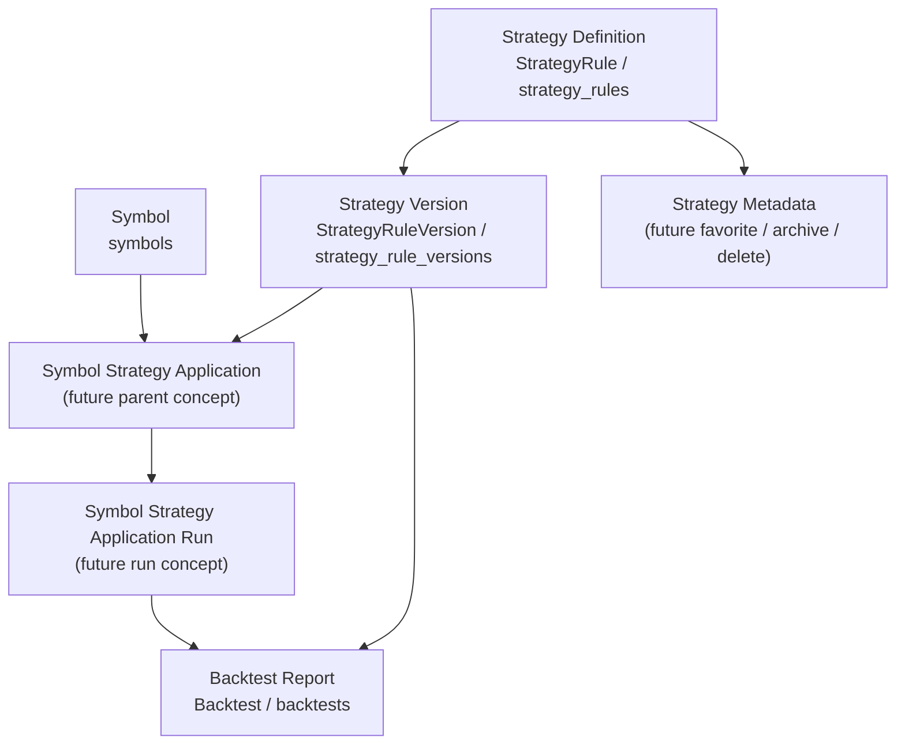

# 北極星 Strategy保存概念整理（P3）

更新日: 2026-05-10

## 1. Purpose

- strategy management と銘柄起点 strategy application の保存概念を整理する。
- Strategy Definition、Strategy Version、Backtest Report、Symbol Strategy Application を分離して扱う。
- この PR では DB 変更を行わず、後続実装で迷わないための比較軸と段階案を固定する。

## 2. Current model summary

現行実装の確認対象は `backend/prisma/schema.prisma`、`backend/src/routes/strategies.ts`、`backend/src/routes/strategy-versions.ts`、`backend/src/routes/backtests.ts`、`backend/src/routes/symbols.ts` である。

### Strategy definition / strategy rule concept

- 現行の Prisma model は `StrategyRule`、DB table は `strategy_rules` である。
- `StrategyRule` は `id`、`userId`、`title`、`status`、`createdAt`、`updatedAt` を持つ。
- relation として `versions` を持つ。
- 現行 routes では `POST /api/strategies` が strategy rule を作成し、`GET /api/strategies/:strategyId/versions` が対象 strategy と version 一覧を返す。
- ただし `StrategyList` / `StrategyDetail` 向けの一覧 read model はまだない。

### Strategy version concept

- 現行の Prisma model は `StrategyRuleVersion`、DB table は `strategy_rule_versions` である。
- `StrategyRuleVersion` は `id`、`strategyRuleId`、`clonedFromVersionId`、`naturalLanguageRule`、`forwardValidationNote`、`forwardValidationNoteUpdatedAt`、`normalizedRuleJson`、`generatedPine`、`warningsJson`、`assumptionsJson`、`market`、`timeframe`、`status`、`createdAt`、`updatedAt` を持つ。
- relation として `backtests`、`pineScripts`、`pineRevisionInputs`、`internalBacktestExecutions` を持つ。
- `StrategyVersionDetail` は version 単位の詳細確認、Pine 生成 / 再生成、内部バックテスト確認の対象である。
- Strategy Definition と Strategy Version は分けて扱う必要がある。

### Backtest report concept

- 現行の Prisma model は `Backtest`、DB table は `backtests` である。
- `Backtest` は `id`、`strategyRuleVersionId`、`strategySnapshotJson`、`title`、`executionSource`、`market`、`timeframe`、`status`、`createdAt`、`updatedAt` を持つ。
- relation として `imports`、`comparisonsAsBase`、`comparisonsAsTarget` を持つ。
- CSV parse summary は現行では `BacktestImport.parsedSummaryJson` に保存される。
- trades / metrics は現行 schema では `Backtest` の direct field ではない。
- `BacktestImport`、`BacktestComparison`、`AiSummary` が Backtest 周辺の CSV import、比較、AI review / summary を支える。
- `BacktestDetail` は個別検証レポート詳細であり、`StrategyDetail` や `SymbolBacktestDetail` に吸収しない。

### Symbol concept

- 現行の Prisma model は `Symbol`、DB table は `symbols` である。
- `Symbol` は `id`、`symbol`、`tradingviewSymbol`、`marketCode`、`symbolCode`、`displayName`、`createdAt`、`updatedAt` を持つ。
- relation として `alertEvents`、`externalReferences`、`researchNotes`、`transactions`、`positions`、`watchlistItems`、`comparisonSymbols` を持つ。
- `SymbolDetail` は snapshot、alerts、AI 論点カード、Research Note、references、`ストラテジー / 検証結果` placeholder section を持つ。

### Current gaps

- dedicated な Symbol Strategy Application の親概念はまだない。
- favorite / archive / delete の保存場所は未固定である。
- applied symbols count の集計元は未固定である。
- related reports aggregation の read model は未固定である。
- Backtest は `strategyRuleVersionId` を持つが、特定 symbol に strategy / version を適用した親概念としてはまだ十分ではない。

## 3. Required future concepts

### Strategy Definition

- 再利用可能な strategy definition。
- 銘柄非依存で、`StrategyList` / `StrategyDetail` の主対象である。
- 現行実装では `StrategyRule` が最も近い。

### Strategy Version

- version 単位の rule、自然言語仕様、generated Pine、warnings / assumptions、市場、時間足を扱う概念。
- `StrategyVersionDetail` の主対象である。
- 現行実装では `StrategyRuleVersion` が該当する。

### Backtest Report

- 個別検証結果の report。
- AI review / summary / trades / artifacts を含む。
- `BacktestDetail` の主対象であり、strategy 管理画面に吸収しない。

### Symbol Strategy Application

- 特定 symbol に特定 strategy / version を適用する親概念。
- `SymbolDetail` の `ストラテジー / 検証結果` section で、適用済み strategy と最新検証結果を束ねるために必要である。
- 同一銘柄に対して同一 strategy を繰り返し CSV import / internal backtest する場合の grouping に使う。

### Symbol Strategy Application Run

- Symbol Strategy Application 配下の個別 run。
- CSV import または internal backtest の 1 実行を表す。
- Backtest Report と link し、`BacktestDetail` は report detail として継続する。

### Strategy Metadata

- favorite、archive、soft delete、usage metadata、last used at、display priority などの strategy 管理用 metadata。
- Strategy Definition 本体に持たせるか、別 table に切り出すかは後続判断とする。

## 4. Storage design options

### Option A: Extend existing backtests only

- `backtests` に `symbol_id`、`strategy_version_id`、context fields を追加して、銘柄起点 run も report 側で表現する。

Pros:

- 初期 DB 変更が最小になりやすい。
- 既存 `BacktestDetail` を再利用しやすい。
- CSV import / internal backtest の既存保存導線に近い。

Cons:

- 繰り返し適用を束ねる親概念が弱い。
- `SymbolDetail` で「この銘柄に適用済みの strategy」を表現しにくい。
- 複数 run や比較画面の grouping が `Backtest` に寄りすぎる。
- `BacktestDetail` が strategy application の責務まで背負いやすい。

### Option B: Add symbol_strategy_applications + application_runs

- `symbol_strategy_applications` のような親 table を追加する。
- run table を追加するか、run から `backtests` に link する。

Pros:

- 銘柄起点の grouping が明確になる。
- `SymbolBacktestDetail` / `SymbolStrategyCompare` へ拡張しやすい。
- CSV import と internal backtest の繰り返し run を扱いやすい。
- `BacktestDetail` を個別 report detail として保ちやすい。

Cons:

- DB / API / migration / route design の変更が大きい。
- 既存 backtests との backfill 方針が必要になる。
- 初回実装で過剰設計にならないよう段階化が必要である。

### Option C: Add strategy_usage_metadata first

- application 親概念は後続に回し、まず StrategyList / StrategyDetail の管理性を高める metadata を追加する。
- favorite、archive、soft delete、last used at、display priority などを扱う。

Pros:

- StrategyList / StrategyDetail の実データ表示を先に進めやすい。
- full application / run model より侵襲が小さい。
- favorite / archive / delete の UX を先に固めやすい。

Cons:

- 銘柄起点 application は解決しない。
- `SymbolDetail` の strategy / results section を本格接続するには別途 application concept が必要になる。
- metadata と application を後でどう接続するかの整理が残る。

## 5. Recommended staged approach

最終 DB schema をこの docs では確定しない。ただし、後続実装の進め方は以下を推奨する。

1. まず existing strategy / version data を使って `StrategyList` / `StrategyDetail` の実データ表示を進める。
2. favorite / archive / delete が必要になった時点で、最小の Strategy Metadata を追加するか判断する。
3. `SymbolDetail` apply flow に入る段階では、`BacktestDetail` を過負荷にせず、dedicated な Symbol Strategy Application 親概念を導入する方向を第一候補にする。
4. `BacktestDetail` は report detail として維持する。
5. application run は Backtest Report に link し、Backtest Report を置き換えない。

## 6. Relationship to screens

### StrategyList

必要になる情報:

- title
- latest version
- version count
- updated at
- favorite / archive state later
- related report count later
- applied symbols count later

初期実装では existing strategy / version data の表示を優先し、favorite / archive / report count / applied symbols count は後続でよい。

### StrategyDetail

必要になる情報:

- definition
- versions
- latest version
- related reports
- applied symbols
- favorite / archive / delete later

`StrategyDetail` は strategy definition の詳細であり、`StrategyVersionDetail` や `BacktestDetail` を置き換えない。

### SymbolDetail

必要になる情報:

- 対象 symbol の strategy applications
- application ごとの latest reports
- CSV import entry point later
- internal backtest entry point later

現時点の `ストラテジー / 検証結果` section は placeholder であり、application data は未接続である。

### BacktestDetail

必要になる情報:

- report detail として継続する。
- 将来、strategy / version / application への back link を持つ。
- strategy management や symbol application parent の責務は持たない。

## 7. Mermaid concept diagram

## 8. API/read model considerations

候補 API は以下である。名称は候補であり、この PR では実装しない。

- `GET /api/strategies`
  - StrategyList 向け。
  - strategy definitions、latest version、version count、updated at を返す候補。
- `GET /api/strategies/:strategyId`
  - StrategyDetail 向け。
  - definition、versions、related reports、applied symbols を返す候補。
- `GET /api/symbols/:symbolId/strategy-applications`
  - SymbolDetail の `ストラテジー / 検証結果` section 向け。
- `POST /api/symbols/:symbolId/strategy-applications`
  - symbol に strategy / version を適用する候補。
- `POST /api/symbol-strategy-application-runs`
  - CSV import または internal backtest run を application に紐付ける候補。

注意:

- この PR では API を実装しない。
- API 名は候補であり、既存 API 名は実装判断まで維持する。
- 既存 `BacktestDetail` / `BacktestList` の route と API を置き換えない。

## 9. Migration risk / open questions

- favorite / archive は `StrategyRule` に直接持たせるか、Strategy Metadata table に切り出すか。
- delete は hard delete ではなく archive / soft delete を優先すべきか。
- application run は専用 table にするか、`backtests` で表現できるか。
- 既存 `backtests` を symbol-origin application にどう backfill するか。
- StrategyLab で作成された既存 backtests を Strategy Definition / Version / Application にどう map するか。
- SymbolDetail から CSV import した場合、application を自動作成するか、事前に strategy 適用を必須にするか。
- `BacktestDetail` に strategy application の情報をどこまで表示し、どこからは application / comparison 画面に逃がすか。
- applied symbols count と related report count を同期集計にするか、read model / cache にするか。

## 10. Implementation phases after this doc

### Phase A: docs-only storage concept design

- 今回。
- DB / API / frontend / backend は変更しない。

### Phase B: existing strategy data display on StrategyList / StrategyDetail

- `StrategyRule` / `StrategyRuleVersion` の existing data を使って placeholder を実データ表示に近づける。
- 可能なら API 追加を最小にし、必要な read model を明確化する。

### Phase C: optional strategy metadata design / migration

- favorite / archive / delete / last used at / display priority を扱うか判断する。
- Strategy Metadata を別 table にするか、Strategy Definition に持たせるか比較する。

### Phase D: Symbol Strategy Application DB design

- dedicated parent concept を DB / API として設計する。
- application run と Backtest Report の link 方針を決める。

### Phase E: SymbolDetail apply UI with existing strategy version selection

- `SymbolDetail` から existing strategy version を選び、application へ進む UI を設計 / 実装する。
- CSV import / internal backtest の実行はまだ分けてよい。

### Phase F: symbol-origin CSV import / internal backtest run creation

- Symbol fixed、strategy version fixed の状態で run を作成する。
- run から Backtest Report を生成または link する。

### Phase G: SymbolBacktestDetail / comparison views

- 同一 symbol × 複数 strategy の比較を扱う。
- Backtest Report detail への link を維持する。

## 11. Not included

- DB migration
- Prisma schema change
- API implementation
- frontend implementation
- route changes
- backend changes
- tests
- Playwright specs

## 追記（2026-05-10）

- Phase B として、既存 `StrategyRule` / `StrategyRuleVersion` data を `StrategyList` / `StrategyDetail` に read-only 表示する段階へ進めた。
- `StrategyList` では既存 strategy definition、version count、latest version summary を表示する。
- `StrategyDetail` では既存 `/api/strategies/:strategyId/versions` を使い、strategy definition と version 一覧を表示する。
- Strategy Metadata、Symbol Strategy Application、Application Run、favorite / archive / delete、applied symbols、related reports は未実装のままとする。

## 追記（2026-05-10 その2）

- Strategy metadata migration decision の詳細正本は [docs/51.北極星 Strategy metadata migration decision（P3）.md](./51.北極星%20Strategy%20metadata%20migration%20decision（P3）.md) とする。
- 推奨は Option C とし、初回は `StrategyRule.status` を `active` / `archived` に使う方向で整理した。
- favorite / last used / display priority は後続判断とする。

## 追記（2026-05-10 その3）

- Strategy metadata implementation の第一段階として、`StrategyRule.status` を使った archive / restore を追加した。
- `StrategyList` / `StrategyDetail` では `active` / `archived` を扱うが、metadata table は追加していない。
- favorite / last used / display priority は引き続き後続判断とする。

## 追記（2026-05-10 その4）

- Symbol Strategy Application はまだ DB 実装していないが、`SymbolDetail` apply UI を selection-only として追加した。
- 既存 active strategy と version を選ぶだけで、application 保存、Application Run 作成、BacktestReport 作成は行わない。
- 次候補は Symbol Strategy Application の DB/API 設計、または related reports / applied symbols display である。

## 追記（2026-05-10 その5）

- Symbol Strategy Application の DB / API 設計は [docs/52.北極星 Symbol Strategy Application DB・API設計（P3）.md](./52.北極星%20Symbol%20Strategy%20Application%20DB・API設計（P3）.md) を正本とする。
- 推奨は application parent table と application run table を分ける案である。
- run から `Backtest` / `BacktestImport` / `InternalBacktestExecution` へ link し、`BacktestDetail` は report detail として維持する。
- この段階では Prisma schema change、DB migration、API 実装は未実施である。

## 追記（2026-05-10 その6）

- Symbol Strategy Application の application parent と application run table を Prisma schema / migration として追加した。
- `BacktestDetail` は application parent ではなく、引き続き report detail として維持する。
- API / frontend / 保存処理は未実装であり、metadata table や favorite / hard delete も追加していない。

## 追記（2026-05-10 その7）

- Symbol Strategy Application の read API を追加した。
- application parent / run table 方針は維持し、`BacktestDetail` は report detail として維持する。
- POST 保存処理、frontend 接続、related reports / applied symbols display は未実装である。
