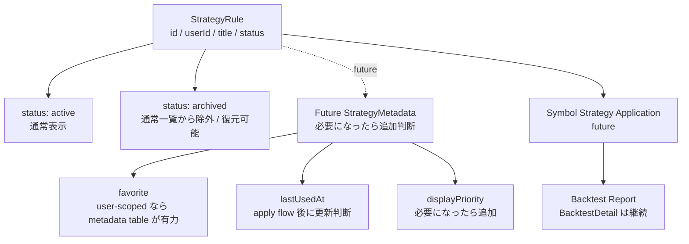

# 北極星 Strategy metadata migration decision（P3）

更新日: 2026-05-10

## 1. 目的

- `StrategyList` / `StrategyDetail` で扱う metadata の保存方針を決める。
- favorite / archive / delete / usage metadata を整理する。
- DB migration 前に、最小実装方針と後続拡張方針を固定する。

## 2. 現行 schema の確認

現行 `StrategyRule` は以下を持つ。

- `id`
- `userId`
- `title`
- `status`
- `createdAt`
- `updatedAt`
- `versions` relation

現行 `StrategyRuleVersion` は version 詳細であり、favorite / archive の主対象ではない。

現行 `StrategyRule.status` は既に存在するため、archive / soft delete の第一候補として検討できる。現時点では DB migration を行わず、既存 `status` の意味づけを先に固定する。

## 3. metadata 要件

### favorite

- `StrategyList` 上で優先表示したい strategy を表す。
- ユーザー単位にするか、strategy definition 自体の属性にするかが論点である。
- multi-user / user-scoped favorite を重視する場合、`StrategyRule` 直下の boolean では不足しやすい。

### archive

- 通常一覧から外したい strategy を表す。
- hard delete ではなく復元可能な状態として扱う。
- 現行 `StrategyRule.status` を `active` / `archived` として扱う候補が最小である。

### soft delete

- 完全削除せず、UI から非表示にする。
- `StrategyRuleVersion` / `Backtest` / report との参照関係を壊さない。
- `deleted` status を使う場合でも、初回は `archived` と区別する必要があるかを慎重に判断する。

### hard delete

- MVP後P3では原則後回しとする。
- version / backtest / reports との参照整合が重い。
- 実装する場合も、管理者向け・明示的な危険操作として別途設計する。

### last used / recent usage

- `SymbolDetail` apply flow や `StrategyList` の並び順に使える。
- 初回実装では不要でもよい。
- application / run concept と接続した段階で更新契機を再判断する。

### display priority

- favorite より細かい並び順が必要になった場合の候補である。
- 初回実装では不要でもよい。
- favorite / recent usage の使い勝手を確認してから追加判断する。

## 4. 保存方式の比較

### Option A: `StrategyRule` に最小 field を追加

候補:

- `isFavorite` Boolean
- `status` を `active` / `archived` / `deleted` に使う
- `lastUsedAt` optional
- `displayPriority` optional

Pros:

- 実装が軽い。
- `StrategyList` / `StrategyDetail` で扱いやすい。
- 既存 `StrategyRule.status` を活用できる。

Cons:

- user-scoped favorite には弱い。
- metadata が増えると `StrategyRule` が肥大化する。
- multi-user 拡張時に再設計が必要になる可能性がある。

### Option B: `StrategyRuleMetadata` table を追加

候補:

- `strategyRuleId`
- `userId`
- `isFavorite`
- `archivedAt`
- `deletedAt`
- `lastUsedAt`
- `displayPriority`

Pros:

- user-scoped metadata に強い。
- future extensibility が高い。
- `StrategyRule` 本体をきれいに保てる。

Cons:

- 初期実装が重い。
- API / migration / uniqueness 制約が増える。
- MVP後P3の最小実装としては過剰になりやすい。

### Option C: archive は `StrategyRule.status`、favorite は後続 metadata

候補:

- archive / soft delete は `StrategyRule.status` で扱う。
- favorite は必要になるまで未実装とする。
- `lastUsedAt` / `displayPriority` も後続判断とする。

Pros:

- 最小。
- 現行 schema の `status` を活用できる。
- hard delete を避けられる。
- `StrategyRuleVersion` / `Backtest` / report との参照整合を壊しにくい。

Cons:

- favorite をすぐ実装できない。
- `StrategyList` の使い勝手改善は限定的である。
- favorite 実装時に追加 migration が必要になる。

## 5. 推奨判断

- 初回は Option C を推奨する。
- `StrategyRule.status` を `active` / `archived` の管理に使う。
- hard delete は後回しにする。
- favorite は、必要性が高まった時点で Option A または Option B を再判断する。
- multi-user / user-scoped favorite を重視するなら Option B を優先する。
- 単一ユーザー運用や軽量実装を優先するなら Option A を検討する。
- 現時点では DB migration はまだ行わず、次の実装では existing strategy data display を維持しつつ archive semantics をこの docs に従って扱う。

## 6. API方針案

候補 API は以下である。名称は候補であり、この PR では実装しない。

- `PATCH /api/strategies/:strategyId`
  - title / status 更新。
- `PATCH /api/strategies/:strategyId/archive`
  - `archived` status へ変更。
- `PATCH /api/strategies/:strategyId/restore`
  - `active` status へ復元。
- `DELETE /api/strategies/:strategyId`
  - hard delete ではなく archive と同義にする案もある。

注意:

- 初回実装では hard delete を避ける。
- `Backtest` / `StrategyRuleVersion` 参照を壊さない。
- API 名は候補であり、この PR では実装しない。

## 7. UI方針案

### StrategyList

- `active` strategy を通常表示する。
- `archived` strategy は filter で表示する案を第一候補にする。
- favorite は未実装、または後続判断とする。
- archive action は後続で実装する。

### StrategyDetail

- `status` を表示する。
- archive / restore action は後続で実装する。
- hard delete は表示しない、または disabled とする。

## 8. Mermaid metadata decision diagram

## 9. 実装段階案

### Phase A: docs-only decision

- 今回。
- DB / API / frontend / backend は変更しない。

### Phase B: `StrategyRule.status` を active / archived として扱う read/filter 方針を API docs に反映

- `GET /api/strategies` の filter 方針を整理する。
- `archived` を通常一覧から外すか、status filter で扱うかを決める。

### Phase C: StrategyList に status filter を追加

- `active` / `archived` の切り替えを UI で扱う。
- favorite はまだ扱わない。

### Phase D: archive / restore API を実装

- `StrategyRule.status` を更新する。
- hard delete は実装しない。

### Phase E: favorite が必要なら Option A または Option B を再判断

- user-scoped favorite が必要なら Option B を優先する。
- 単一ユーザー前提で軽量実装するなら Option A を検討する。

### Phase F: SymbolDetail apply flow の last used 更新を検討

- Symbol Strategy Application / Application Run と接続した段階で `lastUsedAt` の更新契機を決める。

## 10. 今回やらないこと

- Prisma schema change
- DB migration
- API implementation
- frontend implementation
- backend implementation
- favorite implementation
- archive API implementation
- hard delete implementation
- tests
- Playwright specs

## 追記（2026-05-10）

- Phase B / C / D として、`StrategyRule.status` を `active` / `archived` に使う方針を実装に反映した。
- `GET /api/strategies` は `active` / `archived` の status filter を扱い、`StrategyList` では `有効` / `アーカイブ` / `すべて` の切り替えを追加した。
- `PATCH /api/strategies/:strategyId/archive` と `PATCH /api/strategies/:strategyId/restore` を追加し、`StrategyList` / `StrategyDetail` から最小操作できるようにした。
- hard delete は未実装であり、favorite / usage metadata / metadata table も未実装のままとする。
