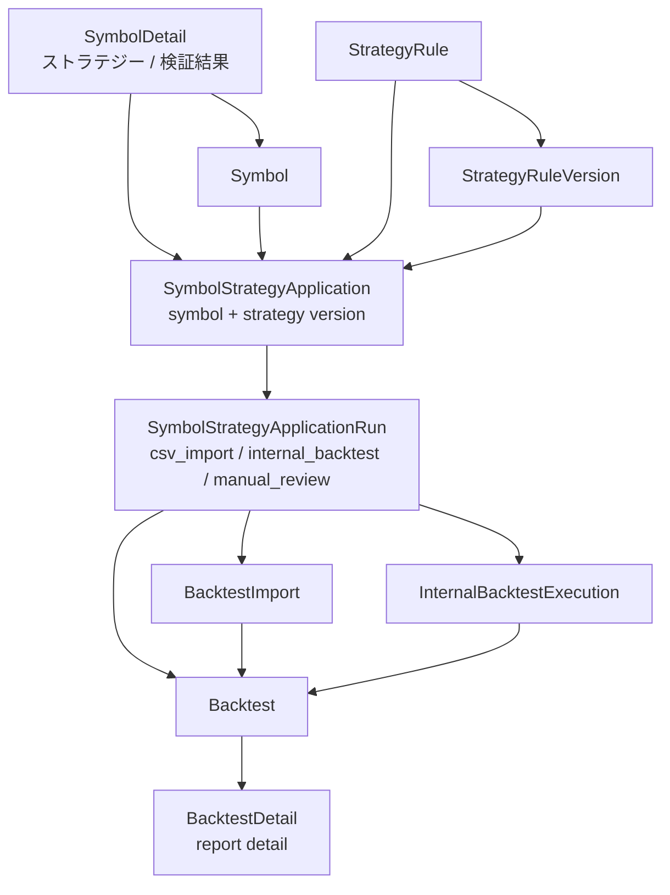

# 北極星 Symbol Strategy Application DB・API設計（P3）

## 1. 目的

- `SymbolDetail` から選択した strategy / version を、銘柄単位の application として保存するための DB / API 設計を固定する。
- CSV import / internal backtest / Backtest Report を application 配下の run として整理する。
- `BacktestDetail` は個別検証レポート詳細として維持する。
- 実装前に schema 候補、API 候補、段階実装順を明確にする。

このドキュメントは設計正本であり、この PR では DB migration、Prisma schema change、backend API 実装、frontend 実装、route 追加は行わない。

## 2. 用語整理

### Symbol Strategy Application

- 特定 `Symbol` に特定 `StrategyRule` / `StrategyRuleVersion` を適用する親概念。
- `SymbolDetail` の `ストラテジー / 検証結果` section の主対象。
- 例: `2148` に strategy A の version 3 を適用する。
- application は「この銘柄にこの strategy version を適用している」という継続的な関係を表す。

### Symbol Strategy Application Run

- application 配下の個別実行。
- CSV import、internal backtest、再実行、manual review などを表す。
- 実行結果として `Backtest` / `BacktestImport` / `InternalBacktestExecution` と接続する。

### Backtest Report

- 既存 `Backtest` / `BacktestDetail` の主対象。
- AI総評、summary、trades、artifacts、import 結果を含む個別 report。
- application に吸収せず、個別検証レポート詳細として維持する。

### Strategy Version

- 適用対象の version。
- 現行 schema 上は `StrategyRuleVersion`。
- 自然言語ルール、生成 Pine、warnings / assumptions、market、timeframe などを保持する。

### Symbol

- 適用対象の銘柄。
- 現行 schema 上は `Symbol`。
- `SymbolDetail` は銘柄起点の application 一覧と run 結果の入口になる。

## 3. 現行 schema との関係

現行 schema に存在する主な関連モデルは以下である。ここでは現在存在する field / relation と、将来候補を混同しない。

### Symbol

- 現行 field:
  - `id`
  - `symbol`
  - `tradingviewSymbol`
  - `marketCode`
  - `symbolCode`
  - `displayName`
  - `createdAt`
  - `updatedAt`
- 現行 relation:
  - `alertEvents`
  - `externalReferences`
  - `researchNotes`
  - `transactions`
  - `positions`
  - `watchlistItems`
  - `comparisonSymbols`

### StrategyRule

- 現行 field:
  - `id`
  - `userId`
  - `title`
  - `status`
  - `createdAt`
  - `updatedAt`
- 現行 relation:
  - `versions`

### StrategyRuleVersion

- 現行 field:
  - `id`
  - `strategyRuleId`
  - `clonedFromVersionId`
  - `naturalLanguageRule`
  - `forwardValidationNote`
  - `forwardValidationNoteUpdatedAt`
  - `normalizedRuleJson`
  - `generatedPine`
  - `warningsJson`
  - `assumptionsJson`
  - `market`
  - `timeframe`
  - `status`
  - `createdAt`
  - `updatedAt`
- 現行 relation:
  - `backtests`
  - `pineScripts`
  - `pineRevisionInputs`
  - `internalBacktestExecutions`

### Backtest

- 現行 field:
  - `id`
  - `strategyRuleVersionId`
  - `strategySnapshotJson`
  - `title`
  - `executionSource`
  - `market`
  - `timeframe`
  - `status`
  - `createdAt`
  - `updatedAt`
- 現行 relation:
  - `imports`
  - `comparisonsAsBase`
  - `comparisonsAsTarget`

### BacktestImport

- 現行 field:
  - `id`
  - `backtestId`
  - `fileName`
  - `fileSize`
  - `contentType`
  - `rawCsvText`
  - `parseStatus`
  - `parseError`
  - `parsedSummaryJson`
  - `createdAt`
  - `updatedAt`
- parsed CSV summary は現行 `BacktestImport.parsedSummaryJson` に保存される。
- trades / metrics は現行 `Backtest` の直接 field ではない。

### InternalBacktestExecution

- 現行 field:
  - `id`
  - `strategyRuleVersionId`
  - `status`
  - `requestedAt`
  - `startedAt`
  - `finishedAt`
  - `inputSnapshotJson`
  - `resultSummaryJson`
  - `artifactPointerJson`
  - `errorCode`
  - `errorMessage`
  - `engineVersion`
  - `createdAt`
  - `updatedAt`
- 現行 relation:
  - `strategyRuleVersion`
  - `artifacts`

### AiSummary

- 現行 field:
  - `id`
  - `aiJobId`
  - `userId`
  - `summaryScope`
  - `targetEntityType`
  - `targetEntityId`
  - `title`
  - `bodyMarkdown`
  - `structuredJson`
  - `modelName`
  - `promptVersion`
  - `generatedAt`
  - `inputSnapshotHash`
  - `generationContextJson`
  - `createdAt`
  - `updatedAt`

## 4. DB schema 候補

### Candidate A: `symbol_strategy_applications`

候補 field:

- `id`
- `symbolId`
- `strategyRuleId`
- `strategyRuleVersionId`
- `status`
  - `active`
  - `archived`
- `source`
  - `manual`
  - `csv_import`
  - `internal_backtest`
- `memo`
- `createdAt`
- `updatedAt`

想定 relation:

- `Symbol`
- `StrategyRule`
- `StrategyRuleVersion`
- `runs`

この table は `SymbolDetail` の `ストラテジー / 検証結果` section で表示する親概念になる。

### Candidate B: `symbol_strategy_application_runs`

候補 field:

- `id`
- `applicationId`
- `runType`
  - `csv_import`
  - `internal_backtest`
  - `manual_review`
- `status`
  - `pending`
  - `running`
  - `succeeded`
  - `failed`
- `backtestId` nullable
- `backtestImportId` nullable
- `internalBacktestExecutionId` nullable
- `startedAt` nullable
- `finishedAt` nullable
- `errorCode` nullable
- `errorMessage` nullable
- `createdAt`
- `updatedAt`

想定 relation:

- `SymbolStrategyApplication`
- `Backtest` nullable
- `BacktestImport` nullable
- `InternalBacktestExecution` nullable

run table を分けることで、同一 application に対する CSV import、internal backtest、再実行を別履歴として扱える。

### Candidate C: Backtest 拡張だけで始める案

候補:

- `Backtest` に `symbolId` / `applicationId` を持たせる。
- run table は作らず、`Backtest` を run と report の両方として扱う。

比較:

- 最小変更で始めやすい。
- ただし application grouping が弱い。
- `BacktestDetail` が親概念まで背負いやすい。
- `SymbolDetail` の適用済み strategy 一覧が作りにくい。

## 5. 推奨 DB 方針

- `symbol_strategy_applications` を親概念として追加する案を第一候補にする。
- run は `symbol_strategy_application_runs` として分ける案を第一候補にする。
- `Backtest` は report detail として維持する。
- run から `Backtest` / `BacktestImport` / `InternalBacktestExecution` へ link する。
- Backtest だけを拡張して親概念を兼ねさせる案は、初期実装は軽いが後続比較画面で詰まりやすいため第二候補とする。

ただし、この PR では DB schema を変更しない。migration 実装は後続とし、field 名は候補として扱う。

## 6. API 候補

### GET `/api/symbols/:symbolId/strategy-applications`

目的:

- `SymbolDetail` の `ストラテジー / 検証結果` section に表示する。
- 対象 symbol の application 一覧を返す。

返却候補:

- application id
- symbol
- strategy
- selected version
- status
- latest run
- latest backtest report
- run count
- created_at
- updated_at

### POST `/api/symbols/:symbolId/strategy-applications`

目的:

- `SymbolDetail` selection UI で選んだ strategy / version を保存する。

payload 候補:

- `strategy_id`
- `strategy_version_id`
- `memo` optional

validation:

- symbol exists
- strategy exists
- strategy status is active
- strategy version exists
- strategy version belongs to strategy
- archived strategy は保存不可
- duplicate を許容するか、同一 symbol + strategy + version を unique にするか検討

### PATCH `/api/symbol-strategy-applications/:applicationId/archive`

目的:

- application を archived にする。

### PATCH `/api/symbol-strategy-applications/:applicationId/restore`

目的:

- archived application を active に戻す。

### POST `/api/symbol-strategy-applications/:applicationId/runs`

目的:

- CSV import / internal backtest の run を作る。

payload 候補:

- `run_type`
- `backtest_id` optional
- `backtest_import_id` optional
- `internal_backtest_execution_id` optional

注意:

- API 名は候補である。
- この PR では実装しない。
- 既存 `/api/backtests` / `/api/strategies` / `/api/strategy-versions` を壊さない。

## 7. duplicate / unique 方針

### Option A: `symbolId + strategyRuleVersionId` を unique にする

- 同じ version の重複適用を防げる。
- version 更新ごとの適用履歴を分けやすい。
- 同じ strategy の別 version を同時に active にできるかは別途判断が必要。

### Option B: `symbolId + strategyRuleId` を active で unique にする

- 同じ strategy の重複適用を防げる。
- ただし同じ strategy の別 version 適用をどう扱うかが難しい。
- version 切り替えが update なのか新 application なのかを決める必要がある。

### Option C: unique 制約は置かず、UIで重複注意を出す

- 柔軟に扱える。
- ただし一覧整理、比較、restore 時の衝突整理が難しくなる。

推奨:

- 初回は `symbolId + strategyRuleVersionId + status(active)` 相当を第一候補にする。
- Prisma / PostgreSQL の partial unique が扱いにくい場合は、API 側 validation で防ぐ案も検討する。
- archived application の再作成 / restore 時の衝突は後続で検討する。

## 8. Backtest / CSV import / internal backtest との接続

### CSV import

- `SymbolDetail` から application を選んだ状態で CSV import を行う。
- `run_type = csv_import` とする。
- `Backtest` / `BacktestImport` を作成または link する。
- 完了後は `BacktestDetail` へ遷移する。

### Internal backtest

- symbol fixed、strategy version fixed の状態で実行する。
- `run_type = internal_backtest` とする。
- `InternalBacktestExecution` を作成または link する。
- 成功時に Backtest Report へ接続する案を検討する。

### BacktestDetail

- application / run への backlink を後続で追加する候補とする。
- report detail の役割は維持する。
- application 一覧や比較画面へ吸収しない。

## 9. SymbolDetail UI との関係

現状:

- active strategy / version を selection-only で選べる。
- 選択内容は未保存である。
- `適用を保存`、CSV取込、internal backtest は未接続である。

次段階:

- `適用を保存` を enabled にする。
- POST application API を呼ぶ。
- 保存後に application list を再取得する。
- CSV取込 / internal backtest buttons は application 保存後に有効化する案を検討する。

## 10. Mermaid DB/API concept diagram

## 11. 実装段階案

Phase A:

- 今回 docs-only DB/API 設計。

Phase B:

- Prisma schema draft / migration PR。
- `symbol_strategy_applications`
- `symbol_strategy_application_runs`

Phase C:

- read API。
- GET symbol applications。

Phase D:

- create application API。
- POST symbol application。
- validation。

Phase E:

- `SymbolDetail` apply 保存処理。
- selection UI から保存する。
- application list を表示する。

Phase F:

- CSV import wiring。
- application run 作成。
- `Backtest` / `BacktestImport` link。

Phase G:

- internal backtest wiring。
- `InternalBacktestExecution` link。
- report 化方針。

Phase H:

- related reports / applied symbols display。
- `StrategyDetail` / `SymbolDetail` / `BacktestDetail` と接続する。

## 12. 今回やらないこと

- Prisma schema change
- DB migration
- backend API implementation
- frontend implementation
- `SymbolDetail` apply 保存処理
- CSV import wiring
- internal backtest wiring
- `BacktestDetail` redesign
- tests
- Playwright specs

## 追記（2026-05-10）

- Phase B として Prisma schema draft / migration を追加した。
- 追加したのは `SymbolStrategyApplication` と `SymbolStrategyApplicationRun` の schema / migration である。
- API / frontend / `SymbolDetail` apply 保存処理は未実装である。
- duplicate / unique は引き続き API validation で扱う候補を維持する。
- 次候補は GET symbol applications API、POST symbol application API、`SymbolDetail` apply 保存処理、CSV import wiring、internal backtest wiring である。

## 追記（2026-05-10 その2）

- Phase C として GET symbol applications API を追加した。
- `GET /api/symbols/:symbolId/strategy-applications` は read-only API として、symbol、query、pagination、applications、strategy、strategy version、latest run、latest backtest report summary、run count を返す。
- POST symbol application API、`SymbolDetail` apply 保存処理、CSV import wiring、internal backtest wiring は未実装である。

## 追記（2026-05-10 その3）

- Phase D として POST symbol application API を追加した。
- `POST /api/symbols/:symbolId/strategy-applications` は symbol / strategy / strategy version を検証し、active duplicate を API 側で防ぐ。
- archived strategy は保存不可とし、strategy version が指定 strategy に属していることを検証する。
- frontend 接続、CSV import wiring、internal backtest wiring、application run 作成 API は未実装である。

## 追記（2026-05-10 その4）

- Phase E として `SymbolDetail` apply保存処理を追加した。
- 既存の GET / POST API を使い、active application 一覧表示と strategy / version 保存を frontend に接続した。
- CSV import wiring、internal backtest wiring、application run 作成 API、related reports / applied symbols display は未実装である。
