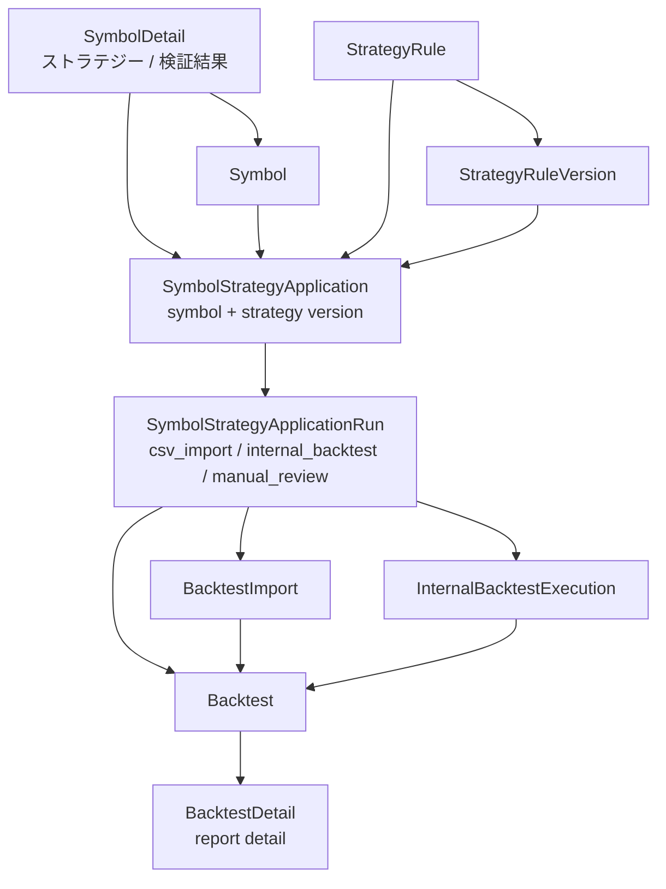

# 北極星 Symbol Strategy Application DB・API設計（P3）

## 1. 目的

- `SymbolDetail` から選択した strategy / version を、銘柄単位の application として保存するための DB / API 設計を固定する。
- CSV import / internal backtest / Backtest Report を application 配下の run として整理する。
- `BacktestDetail` は個別検証レポート詳細として維持する。
- 実装前に schema 候補、API 候補、段階実装順を明確にする。

このドキュメントは設計正本であり、この PR では DB migration、Prisma schema change、backend API 実装、frontend 実装、route 追加は行わない。

## 2. 用語整理

### Symbol Strategy Application

- 特定 `Symbol` に特定 `StrategyRule` / `StrategyRuleVersion` を適用する親概念。
- `SymbolDetail` の `ストラテジー / 検証結果` section の主対象。
- 例: `2148` に strategy A の version 3 を適用する。
- application は「この銘柄にこの strategy version を適用している」という継続的な関係を表す。

### Symbol Strategy Application Run

- application 配下の個別実行。
- CSV import、internal backtest、再実行、manual review などを表す。
- 実行結果として `Backtest` / `BacktestImport` / `InternalBacktestExecution` と接続する。

### Backtest Report

- 既存 `Backtest` / `BacktestDetail` の主対象。
- AI総評、summary、trades、artifacts、import 結果を含む個別 report。
- application に吸収せず、個別検証レポート詳細として維持する。

### Strategy Version

- 適用対象の version。
- 現行 schema 上は `StrategyRuleVersion`。
- 自然言語ルール、生成 Pine、warnings / assumptions、market、timeframe などを保持する。

### Symbol

- 適用対象の銘柄。
- 現行 schema 上は `Symbol`。
- `SymbolDetail` は銘柄起点の application 一覧と run 結果の入口になる。

## 3. 現行 schema との関係

現行 schema に存在する主な関連モデルは以下である。ここでは現在存在する field / relation と、将来候補を混同しない。

### Symbol

- 現行 field:
  - `id`
  - `symbol`
  - `tradingviewSymbol`
  - `marketCode`
  - `symbolCode`
  - `displayName`
  - `createdAt`
  - `updatedAt`
- 現行 relation:
  - `alertEvents`
  - `externalReferences`
  - `researchNotes`
  - `transactions`
  - `positions`
  - `watchlistItems`
  - `comparisonSymbols`

### StrategyRule

- 現行 field:
  - `id`
  - `userId`
  - `title`
  - `status`
  - `createdAt`
  - `updatedAt`
- 現行 relation:
  - `versions`

### StrategyRuleVersion

- 現行 field:
  - `id`
  - `strategyRuleId`
  - `clonedFromVersionId`
  - `naturalLanguageRule`
  - `forwardValidationNote`
  - `forwardValidationNoteUpdatedAt`
  - `normalizedRuleJson`
  - `generatedPine`
  - `warningsJson`
  - `assumptionsJson`
  - `market`
  - `timeframe`
  - `status`
  - `createdAt`
  - `updatedAt`
- 現行 relation:
  - `backtests`
  - `pineScripts`
  - `pineRevisionInputs`
  - `internalBacktestExecutions`

### Backtest

- 現行 field:
  - `id`
  - `strategyRuleVersionId`
  - `strategySnapshotJson`
  - `title`
  - `executionSource`
  - `market`
  - `timeframe`
  - `status`
  - `createdAt`
  - `updatedAt`
- 現行 relation:
  - `imports`
  - `comparisonsAsBase`
  - `comparisonsAsTarget`

### BacktestImport

- 現行 field:
  - `id`
  - `backtestId`
  - `fileName`
  - `fileSize`
  - `contentType`
  - `rawCsvText`
  - `parseStatus`
  - `parseError`
  - `parsedSummaryJson`
  - `createdAt`
  - `updatedAt`
- parsed CSV summary は現行 `BacktestImport.parsedSummaryJson` に保存される。
- trades / metrics は現行 `Backtest` の直接 field ではない。

### InternalBacktestExecution

- 現行 field:
  - `id`
  - `strategyRuleVersionId`
  - `status`
  - `requestedAt`
  - `startedAt`
  - `finishedAt`
  - `inputSnapshotJson`
  - `resultSummaryJson`
  - `artifactPointerJson`
  - `errorCode`
  - `errorMessage`
  - `engineVersion`
  - `createdAt`
  - `updatedAt`
- 現行 relation:
  - `strategyRuleVersion`
  - `artifacts`

### AiSummary

- 現行 field:
  - `id`
  - `aiJobId`
  - `userId`
  - `summaryScope`
  - `targetEntityType`
  - `targetEntityId`
  - `title`
  - `bodyMarkdown`
  - `structuredJson`
  - `modelName`
  - `promptVersion`
  - `generatedAt`
  - `inputSnapshotHash`
  - `generationContextJson`
  - `createdAt`
  - `updatedAt`

## 4. DB schema 候補

### Candidate A: `symbol_strategy_applications`

候補 field:

- `id`
- `symbolId`
- `strategyRuleId`
- `strategyRuleVersionId`
- `status`
  - `active`
  - `archived`
- `source`
  - `manual`
  - `csv_import`
  - `internal_backtest`
- `memo`
- `createdAt`
- `updatedAt`

想定 relation:

- `Symbol`
- `StrategyRule`
- `StrategyRuleVersion`
- `runs`

この table は `SymbolDetail` の `ストラテジー / 検証結果` section で表示する親概念になる。

### Candidate B: `symbol_strategy_application_runs`

候補 field:

- `id`
- `applicationId`
- `runType`
  - `csv_import`
  - `internal_backtest`
  - `manual_review`
- `status`
  - `pending`
  - `running`
  - `succeeded`
  - `failed`
- `backtestId` nullable
- `backtestImportId` nullable
- `internalBacktestExecutionId` nullable
- `startedAt` nullable
- `finishedAt` nullable
- `errorCode` nullable
- `errorMessage` nullable
- `createdAt`
- `updatedAt`

想定 relation:

- `SymbolStrategyApplication`
- `Backtest` nullable
- `BacktestImport` nullable
- `InternalBacktestExecution` nullable

run table を分けることで、同一 application に対する CSV import、internal backtest、再実行を別履歴として扱える。

### Candidate C: Backtest 拡張だけで始める案

候補:

- `Backtest` に `symbolId` / `applicationId` を持たせる。
- run table は作らず、`Backtest` を run と report の両方として扱う。

比較:

- 最小変更で始めやすい。
- ただし application grouping が弱い。
- `BacktestDetail` が親概念まで背負いやすい。
- `SymbolDetail` の適用済み strategy 一覧が作りにくい。

## 5. 推奨 DB 方針

- `symbol_strategy_applications` を親概念として追加する案を第一候補にする。
- run は `symbol_strategy_application_runs` として分ける案を第一候補にする。
- `Backtest` は report detail として維持する。
- run から `Backtest` / `BacktestImport` / `InternalBacktestExecution` へ link する。
- Backtest だけを拡張して親概念を兼ねさせる案は、初期実装は軽いが後続比較画面で詰まりやすいため第二候補とする。

ただし、この PR では DB schema を変更しない。migration 実装は後続とし、field 名は候補として扱う。

## 6. API 候補

### GET `/api/symbols/:symbolId/strategy-applications`

目的:

- `SymbolDetail` の `ストラテジー / 検証結果` section に表示する。
- 対象 symbol の application 一覧を返す。

返却候補:

- application id
- symbol
- strategy
- selected version
- status
- latest run
- latest backtest report
- run count
- created_at
- updated_at

### POST `/api/symbols/:symbolId/strategy-applications`

目的:

- `SymbolDetail` selection UI で選んだ strategy / version を保存する。

payload 候補:

- `strategy_id`
- `strategy_version_id`
- `memo` optional

validation:

- symbol exists
- strategy exists
- strategy status is active
- strategy version exists
- strategy version belongs to strategy
- archived strategy は保存不可
- duplicate を許容するか、同一 symbol + strategy + version を unique にするか検討

### PATCH `/api/symbol-strategy-applications/:applicationId/archive`

目的:

- application を archived にする。

### PATCH `/api/symbol-strategy-applications/:applicationId/restore`

目的:

- archived application を active に戻す。

### POST `/api/symbol-strategy-applications/:applicationId/runs`

目的:

- CSV import / internal backtest の run を作る。

payload 候補:

- `run_type`
- `backtest_id` optional
- `backtest_import_id` optional
- `internal_backtest_execution_id` optional

注意:

- API 名は候補である。
- この PR では実装しない。
- 既存 `/api/backtests` / `/api/strategies` / `/api/strategy-versions` を壊さない。

## 7. duplicate / unique 方針

### Option A: `symbolId + strategyRuleVersionId` を unique にする

- 同じ version の重複適用を防げる。
- version 更新ごとの適用履歴を分けやすい。
- 同じ strategy の別 version を同時に active にできるかは別途判断が必要。

### Option B: `symbolId + strategyRuleId` を active で unique にする

- 同じ strategy の重複適用を防げる。
- ただし同じ strategy の別 version 適用をどう扱うかが難しい。
- version 切り替えが update なのか新 application なのかを決める必要がある。

### Option C: unique 制約は置かず、UIで重複注意を出す

- 柔軟に扱える。
- ただし一覧整理、比較、restore 時の衝突整理が難しくなる。

推奨:

- 初回は `symbolId + strategyRuleVersionId + status(active)` 相当を第一候補にする。
- Prisma / PostgreSQL の partial unique が扱いにくい場合は、API 側 validation で防ぐ案も検討する。
- archived application の再作成 / restore 時の衝突は後続で検討する。

## 8. Backtest / CSV import / internal backtest との接続

### CSV import

- `SymbolDetail` から application を選んだ状態で CSV import を行う。
- `run_type = csv_import` とする。
- `Backtest` / `BacktestImport` を作成または link する。
- 完了後は `BacktestDetail` へ遷移する。

### Internal backtest

- symbol fixed、strategy version fixed の状態で実行する。
- `run_type = internal_backtest` とする。
- `InternalBacktestExecution` を作成または link する。
- 成功時に Backtest Report へ接続する案を検討する。

### BacktestDetail

- application / run への backlink を後続で追加する候補とする。
- report detail の役割は維持する。
- application 一覧や比較画面へ吸収しない。

## 9. SymbolDetail UI との関係

現状:

- active strategy / version を selection-only で選べる。
- 選択内容は未保存である。
- `適用を保存`、CSV取込、internal backtest は未接続である。

次段階:

- `適用を保存` を enabled にする。
- POST application API を呼ぶ。
- 保存後に application list を再取得する。
- CSV取込 / internal backtest buttons は application 保存後に有効化する案を検討する。

## 10. Mermaid DB/API concept diagram

## 11. 実装段階案

Phase A:

- 今回 docs-only DB/API 設計。

Phase B:

- Prisma schema draft / migration PR。
- `symbol_strategy_applications`
- `symbol_strategy_application_runs`

Phase C:

- read API。
- GET symbol applications。

Phase D:

- create application API。
- POST symbol application。
- validation。

Phase E:

- `SymbolDetail` apply 保存処理。
- selection UI から保存する。
- application list を表示する。

Phase F:

- CSV import wiring。
- application run 作成。
- `Backtest` / `BacktestImport` link。

Phase G:

- internal backtest wiring。
- `InternalBacktestExecution` link。
- report 化方針。

Phase H:

- related reports / applied symbols display。
- `StrategyDetail` / `SymbolDetail` / `BacktestDetail` と接続する。

## 12. 今回やらないこと

- Prisma schema change
- DB migration
- backend API implementation
- frontend implementation
- `SymbolDetail` apply 保存処理
- CSV import wiring
- internal backtest wiring
- `BacktestDetail` redesign
- tests
- Playwright specs

## 追記（2026-05-10）

- Phase B として Prisma schema draft / migration を追加した。
- 追加したのは `SymbolStrategyApplication` と `SymbolStrategyApplicationRun` の schema / migration である。
- API / frontend / `SymbolDetail` apply 保存処理は未実装である。
- duplicate / unique は引き続き API validation で扱う候補を維持する。
- 次候補は GET symbol applications API、POST symbol application API、`SymbolDetail` apply 保存処理、CSV import wiring、internal backtest wiring である。

## 追記（2026-05-10 その2）

- Phase C として GET symbol applications API を追加した。
- `GET /api/symbols/:symbolId/strategy-applications` は read-only API として、symbol、query、pagination、applications、strategy、strategy version、latest run、latest backtest report summary、run count を返す。
- POST symbol application API、`SymbolDetail` apply 保存処理、CSV import wiring、internal backtest wiring は未実装である。

## 追記（2026-05-10 その3）

- Phase D として POST symbol application API を追加した。
- `POST /api/symbols/:symbolId/strategy-applications` は symbol / strategy / strategy version を検証し、active duplicate を API 側で防ぐ。
- archived strategy は保存不可とし、strategy version が指定 strategy に属していることを検証する。
- frontend 接続、CSV import wiring、internal backtest wiring、application run 作成 API は未実装である。

## 追記（2026-05-10 その4）

- Phase E として `SymbolDetail` apply保存処理を追加した。
- 既存の GET / POST API を使い、active application 一覧表示と strategy / version 保存を frontend に接続した。
- CSV import wiring、internal backtest wiring、application run 作成 API、related reports / applied symbols display は未実装である。

## 追記（2026-05-10 その5）

- Phase F として CSV import wiring を追加した。
- 保存済み application から Backtest / BacktestImport / SymbolStrategyApplicationRun を作成し、latest run / latest report に反映する。
- internal backtest wiring、related reports / applied symbols display、application archive / restore API は未実装である。

## 追記（2026-05-10 その6）

- Phase G として internal backtest wiring を追加した。
- 保存済み application から InternalBacktestExecution と SymbolStrategyApplicationRun を作成し、run から InternalBacktestExecution へ link する。
- internal backtest では Backtest / BacktestImport は作成せず、report 化 / BacktestDetail backlink は後続タスクとして残す。
- related reports / applied symbols display、application archive / restore API、internal execution result display from `SymbolDetail` は未実装である。

## 追記（2026-05-10 その7）

- Phase H の一部として related reports / applied symbols display を read-only で追加した。
- `StrategyDetail` / `SymbolDetail` / `BacktestDetail` に application / run / report の関係を接続した。
- application archive / restore、internal execution result detail、report 化、BacktestDetail redesign は未実装である。

## 追記（2026-05-10 その8）

- Symbol Strategy Application の archive / restore API を追加した。
- archive / restore は application parent の status 操作であり、runs / Backtest / BacktestImport / InternalBacktestExecution は削除しない。
- restore 時は同一 symbol + strategy version の active duplicate を API 側で 409 として扱う。
- hard delete、internal execution result detail、BacktestDetail redesign は未実装である。

## 追記（2026-05-10 その9）

- Phase H の後続として、`SymbolDetail` から internal backtest execution result を read-only で確認できる表示を追加した。
- latest run が `internal_backtest` の場合に、既存 execution status API と result API から queued / running / failed / succeeded と result summary metrics を表示する。
- DB migration、Prisma schema change、backend API change、Backtest report 化、BacktestDetail redesign は行っていない。

## 追記（2026-05-10 その10）

- Phase H の後続として BacktestDetail backlink refinement を追加済みとした。
- BacktestDetail の `銘柄起点の適用情報` section で、application status / source / run status / symbol / strategy / strategy version を read-only に表示する。
- BacktestDetail redesign、report conversion、application archive / restore の追加変更は行っていない。

## 追記（2026-05-10 その9）

- Symbol Strategy Application の保存済み表示について、`SymbolDetail` 内で summary / latest run / latest report の表示責務を小さく分割した。
- DB / API / application run / Backtest / InternalBacktestExecution の仕様は変更していない。

## 追記（2026-05-10）

- `BacktestDetail` の `銘柄起点の適用情報` 表示を整理した。
- application / run / symbol / strategy / strategy version の read-only backlink を見やすくし、DB schema / API shape / Backtest report の役割は変更していない。

## 追記（2026-05-10）

- Symbol Strategy Application 周辺の P3 現在地は [[53.北極星 P3現在地と残課題整理（P3）]] に整理した。
- schema / read API / create API / SymbolDetail save / CSV import wiring / internal backtest wiring / archive restore / read-only backlinks は完了扱いとし、Backtest report 化や result 詳細表示は残課題として扱う。

## 追記（2026-05-10 その11）

- internal backtest result の Backtest report 化について、最小実装方針を固定した。
- `InternalBacktestExecution.status` が `succeeded` の場合のみ `Backtest` を作成し、`SymbolStrategyApplicationRun.backtestId` に link する。
- `Backtest.executionSource` は `internal_backtest`、`Backtest.status` は `completed` とする。
- `strategySnapshotJson` には既存 strategy snapshot に加えて `internal_backtest_execution_id`、`input_snapshot`、`result_summary`、`artifact_pointer`、`reported_at` を保存する。
- internal backtest 由来 report では `BacktestImport` を作成しない。`BacktestImport` は TradingView CSV import の raw / parsed summary を保持する用途に限定する。
- `SymbolStrategyApplicationRun` は `internalBacktestExecutionId` と `backtestId` の両方を持てる。execution は実行記録、backtest は report detail への参照として扱う。
- 同じ execution から二重に `Backtest` を作成しないよう、既存 `run.backtestId` があれば既存 report を返す冪等 API とする。
- queued / running / failed / canceled execution は report 化しない。
- `BacktestDetail` は CSV import 由来 report と internal backtest 由来 report の共通 detail として維持する。AI summary generation は自動実行しない。
- 最小実装 endpoint は `POST /api/symbol-strategy-applications/:applicationId/internal-backtests/:executionId/report` とし、frontend 接続は後続判断とする。
- DB unique constraint なしの最小実装では、transaction 内の guarded update（backtestId = null 条件）で同一 execution からの二重 Backtest 作成を防ぐ。

## 追記（2026-05-10 その12）

- internal backtest report conversion API を `SymbolDetail` から呼び出せるようにした。
- latest run が `internal_backtest` で execution status が `succeeded`、かつ `backtestId` が未作成の場合のみ `Backtest report を作成` 導線を表示する。
- report 化後は application list を再取得し、`latest_backtest_report` / `run.backtest_id` を UI に反映する。
- 既に report がある場合は二重作成せず、BacktestDetail への導線を優先する。
- backend API / DB / Prisma schema / CSV import / internal backtest execution の既存挙動は変更していない。

## 追記（2026-05-10）

- internal backtest 由来の Backtest report は `BacktestImport` を作成しない importless report として扱う。
- `BacktestDetail` では `strategySnapshotJson` に保存された `internal_backtest_execution_id` / `result_summary` / `artifact_pointer` を read-only に表示し、CSV import 由来 report と区別できるようにした。
- CSV import 由来 report の import / parsed summary / artifact 表示は維持する。
- AI summary 自動生成、BacktestImport の internal backtest への流用、BacktestDetail 全面 redesign は未実装のままとする。

## 追記（2026-05-10）

- Backtest AI summary 生成時に、CSV import 由来 report と internal backtest 由来 importless report の入力文脈を分けるようにした。
- CSV import 由来 report では従来どおり `BacktestImport` / parsed summary / comparison diff を AI summary input に使う。
- internal backtest 由来 report では `BacktestImport` がないことをエラー扱いせず、`strategySnapshotJson` の `internal_backtest_execution_id` / `result_summary` / `artifact_pointer` を AI summary input に含める。
- AI summary の生成 endpoint と UI 導線は既存のまま維持し、自動生成や BacktestDetail redesign は行わない。

## 追記（2026-05-10）

- BacktestDetail で internal backtest 由来 report の artifact 表示を整理した。
- `strategySnapshotJson.artifact_pointer` は kind / type / execution_id / path / summary_mode などの概要 field と raw JSON を併記する。
- artifact がない場合は未生成または未保存として扱い、artifact file の実体読込や download は行わない。

## 追記（2026-05-10）internal backtest report 化完了整理

- Symbol Strategy Application / Run / Backtest report の関係は、internal backtest report 化まで一通り接続済みとする。
- 完了扱い: succeeded execution のみ Backtest report 化、conversion API、transaction 内 guarded update による冪等化、`BacktestImport` を作らない importless report、`SymbolStrategyApplicationRun.internalBacktestExecutionId` と `backtestId` の併存、`SymbolDetail` からの report 化 UI、`BacktestDetail` の importless / AI summary context / artifact 表示整理。
- 残課題: AI summary 自動生成、BacktestDetail 全面 redesign、artifact file 実体読込 / download、internal backtest polling 本格化、CSV import 由来 report との比較 UX、追加 smoke / Visual regression。
- `BacktestDetail` は引き続き個別検証レポート詳細であり、Application parent や Run history を置き換えない。

## 追記（2026-05-10）browser smoke 範囲判断

- internal backtest report 系の browser smoke は read-only 確認に限定する。
- seed 済み internal_backtest 由来 Backtest report を使い、`BacktestDetail` の importless report 表示、execution id、result summary、artifact pointer、SymbolDetail / StrategyDetail backlink を確認する。
- Playwright では internal backtest 実行、report conversion API 実行、AI summary 生成を行わない。

## 追記（2026-05-11）CSV / internal report 比較 UX 観点

- Symbol Strategy Application / Run 配下には CSV import 由来 report と internal backtest 由来 report が併存できる。
- CSV import report は `BacktestImport` / parsed summary を持つ外部検証結果、internal backtest report は `BacktestImport` を持たない engine result report として扱う。
- 比較 UX の初回候補は、同一 application 配下の report 由来、期間、主要 metrics、AI summary を read-only に見比べる導線とする。
- 本格比較画面、comparison entity、metrics 正規化 table は後続フェーズ判断とする。

## 追記（2026-05-11）report 由来表示の最小実装

- CSV import report と internal backtest report の比較 UX 初手として、既存 `execution_source` を `StrategyDetail` / `SymbolDetail` で読みやすく表示する実装を追加した。
- Symbol Strategy Application / Run / Backtest report の schema と API shape は変更していない。
- 同一 application 配下の report 一覧や metrics 正規化 response は後続判断とする。

## 追記（2026-05-11）同一 application 関連 report 導線

- `BacktestDetail` の Symbol Strategy Application backlink に、同一 application 配下の別 report を示す optional `related_reports` を追加した。
- `related_reports` は backtest 付き run の read-only summary であり、現在表示中の report 自身は除外する。
- Symbol Strategy Application / Run / Backtest の既存 relation から読める範囲に限定し、DB schema と migration は変更していない。

## 追記（2026-05-11）CSV / internal report 比較 UX 第一段階完了

- CSV import report と internal backtest report の比較 UX 第一段階は、read-only 導線中心で完了扱いにする。
- `StrategyDetail` / `SymbolDetail` では report type / source を表示し、`BacktestDetail` では同一 application 配下の `related_reports` から別 report へ辿れるようにした。
- `related_reports` は optional response であり、既存 Symbol Strategy Application / Run / Backtest relation から読める範囲に限定する。
- metrics 横並び比較、comparison entity、metrics normalization table、本格 report list は後続フェーズ判断とする。

## 追記（2026-05-11）report metrics 横並び比較 read model

- `BacktestDetail` の同一 Symbol Strategy Application 関連 report 導線に、optional metrics summary を追加した。
- CSV import report は `BacktestImport.parsedSummaryJson`、internal backtest report は `Backtest.strategySnapshotJson.result_summary` を元に、既存 relation から読める metrics だけを返す。
- metrics summary は read-only 表示用であり、比較結果の永続化、metrics normalization table、DB migration、Prisma schema change は行わない。
- 本格比較画面や metrics 正規化は、横並び表示の利用価値を確認してから後続フェーズで判断する。

## 追記（2026-05-11）BacktestDetail read-only metrics comparison 完了整理

- `BacktestDetail` の同一 application 関連 report 導線は、metrics 横並び比較補助まで接続済みとする。
- optional `current_report.metrics` / `related_reports[].metrics` は read-only 表示用であり、既存 `BacktestImport.parsedSummaryJson` と `Backtest.strategySnapshotJson.result_summary` から取得できる範囲に限定する。
- comparison entity、metrics normalization table、新規比較画面、比較結果保存は未実装として残す。

## 追記（2026-05-11）SymbolDetail latest reports by source

- `GET /api/symbols/:symbolId/strategy-applications` に optional `latest_reports_by_source` を追加し、CSV import report と internal backtest report の latest pair を application row で確認できるようにした。
- `latest_reports_by_source.csv_import` / `latest_reports_by_source.internal_backtest` は source ごとの最新 backtest 付き run summary であり、既存 `latest_backtest_report` は従来どおり latest run に backtest がある場合だけ返す。
- これは read-only 表示用の最小 read model であり、DB schema、migration、comparison entity、metrics normalization table は追加しない。

## 追記（2026-05-11）CSV / internal report 比較 UX の現在地

- Symbol Strategy Application / Run / Backtest report の関係は、CSV import report と internal backtest report を同一 application 配下で read-only に見比べる段階まで接続済みとする。
- `StrategyDetail` / `SymbolDetail` では report type / source、`BacktestDetail` では同一 application 関連 report と metrics 横並び比較補助、`SymbolDetail` では `latest_reports_by_source` による CSV / internal latest pair を表示する。
- 現時点の比較 UX は既存 relation と optional read-only response に限定し、新規比較画面、comparison entity、metrics normalization table、DB migration、Prisma schema change は後続判断として残す。

## 追記（2026-05-11）SymbolDetail saved application filter

- `SymbolDetail` の saved application 表示は、既存 `GET /api/symbols/:symbolId/strategy-applications` response を使った client-side filter / summary まで接続済みとする。
- 初回 filter は `すべて` / `reportあり` / `reportなし` に限定し、server-side pagination / filter や archived application を含む本格一覧は後続判断とする。

## 追記（2026-05-11）SymbolDetail application / report 表示改善の現在地

- `SymbolDetail` は saved application / latest run / latest report / CSV-internal latest pair を既存 response の範囲で read-only に表示できる状態とする。
- `latest_reports_by_source` は CSV import report と internal backtest report の latest pair 表示専用 read model とし、client-side filter は `すべて` / `reportあり` / `reportなし` に限定する。
- server-side pagination / filter、archived application を含む本格一覧、同一 application report list grouping、report metrics の一覧内比較は後続フェーズ判断とする。

## 追記（2026-05-11）server-side pagination / filter API候補

- Symbol Strategy Application / run が増えた場合の第一候補は、既存 `GET /api/symbols/:symbolId/strategy-applications` の後方互換拡張とする。
- 現行の `page` / `limit` / `sort` / `order` / `status` を維持し、default は `status=active`、`sort=updated_at`、`order=desc` とする。
- optional query 候補は `report_presence`、`report_source`、`strategy_id`、`strategy_version_id`、`run_type`、`run_status` とする。
- `latest_run`、`latest_backtest_report`、`latest_reports_by_source` は当面維持し、未指定 query では現行 response と同じ意味を保つ。
- 初回 server-side filter は既存 schema で実現可能と判断し、DB migration / Prisma schema change は前提にしない。
- application 配下の run 履歴や report list が主対象になる場合のみ、`GET /api/symbol-strategy-applications/:applicationId/runs` や reports endpoint を後続で検討する。

## 追記（2026-05-11）server-side filter 最小実装

- `GET /api/symbols/:symbolId/strategy-applications` は、後方互換を維持したまま `status=active|archived|all` と `report_presence=with_reports|without_reports` を受け取れるようにした。
- 未指定時は `status=active`、`report_presence` なしの従来 response と同じ意味を維持する。
- `report_presence` は application 配下の run が backtest report を持つかどうかで判定し、`latest_run` / `latest_backtest_report` / `latest_reports_by_source` は従来どおり返す。
- `SymbolDetail` の saved application filter は、この server-side `report_presence` に接続済みとする。
- `report_source` と latest run 基準の run type / run status filter は後続で最小実装済み。strategy / version filter、application-specific runs endpoint は後続判断とする。

## 追記（2026-05-11）server-side filter API 現在地

- Symbol Strategy Application list API の server-side filter は、`status` と `report_presence` までを最小実装済みとする。
- 既存 response の `applications[]`、`latest_run`、`latest_backtest_report`、`latest_reports_by_source`、pagination meta は維持する。
- `status=all` は active / archived を含む API option であり、UI 上の archived application 本格一覧は後続判断とする。
- `report_source` と latest run 基準の run type / run status filter は後続で最小実装済み。strategy / strategy version による絞り込みは未実装として残す。
- DB migration / Prisma schema change は不要な範囲で進めており、大量データ時の index / read model / cache は後続判断とする。

## 追記（2026-05-11）report_source server-side filter

- `GET /api/symbols/:symbolId/strategy-applications` は optional `report_source=csv_import|internal_backtest` を受け取れるようにした。
- 判定は application 配下の run / backtest relation から読める範囲に限定し、CSV import report または internal backtest report を持つ application を server-side で絞り込む。
- `report_presence` との組み合わせは後方互換を維持し、未指定時の active application list、`latest_run`、`latest_backtest_report`、`latest_reports_by_source`、pagination meta は維持する。
- DB migration / Prisma schema change は不要な範囲として扱う。

## 追記（2026-05-11）run_type / run_status filter API候補

- Symbol Strategy Application list API に `run_type=csv_import|internal_backtest` と `run_status=queued|running|succeeded|failed|canceled` を追加する場合、初回は `latest_run` 基準を第一候補にする。
- any run 履歴検索は、既存 list endpoint ではなく application-specific runs endpoint の設計対象に送る。
- `status` / `report_presence` / `report_source` とは optional query として組み合わせ可能にし、未指定時の response meaning は維持する。
- 初回方針では DB migration / Prisma schema change は不要とし、大量データ時のみ index / read model / latest run cache を後続判断とする。

## 追記（2026-05-11）run_type / run_status server-side filter

- `GET /api/symbols/:symbolId/strategy-applications` は optional `run_type=csv_import|internal_backtest` と `run_status=queued|running|succeeded|failed|canceled` を受け取れるようにした。
- filter semantics は `latest_run` 基準であり、application 配下の any run 履歴検索は扱わない。
- `status` / `report_presence` / `report_source` とは AND 条件として組み合わせ、未指定時の response meaning と latest report 系 field は維持する。
- DB migration / Prisma schema change は不要な範囲として扱い、any run 履歴検索は application-specific runs endpoint の後続設計へ送る。

## 追記（2026-05-11）server-side filter 第一段階 API 現在地

- `GET /api/symbols/:symbolId/strategy-applications` は、後方互換を維持したまま `status`、`report_presence`、`report_source`、`run_type`、`run_status` を受け取れる状態になった。
- `run_type` / `run_status` は `latest_run` 基準であり、any run 履歴検索は application-specific runs endpoint の後続設計へ送る。
- 未指定時は従来どおり `status=active` の application list を返し、`latest_run`、`latest_backtest_report`、`latest_reports_by_source`、pagination meta は維持する。
- DB migration / Prisma schema change は行っていない。

### 追記（2026-05-12）list endpoint strategy / version filter 最小仕様

実装済みの `GET /api/symbols/:symbolId/strategy-applications` は、既存 response の意味を変えずに次の optional query を受け取る。

- `strategy_id`: `SymbolStrategyApplication.strategyRuleId` で絞り込む。
- `strategy_version_id`: `SymbolStrategyApplication.strategyRuleVersionId` で絞り込む。
- 両方を指定した場合は AND 条件で扱う。
- 未指定時は従来どおり `status=active` 相当の active application list を返す。
- `status`、`report_presence`、`report_source`、`run_type`、`run_status` と組み合わせ可能とする。
- 一致する application がない場合は 404 ではなく空配列を返す。
- 空文字 query と UUID 形式ではない query は `400 VALIDATION_ERROR` とする。
- `latest_run`、`latest_backtest_report`、`latest_reports_by_source`、pagination meta は維持する。
- DB migration / Prisma schema change は行わない。

## 追記（2026-05-12）Application Detail / History foundation 完了

- `GET /api/symbol-strategy-applications/:applicationId/runs` を read-only endpoint として実装した。
- runs endpoint は application 配下の any run 履歴を主語にし、`page` / `limit` / `sort` / `order`、`run_type`、`run_status` を受け取る。
- runs response は application summary、pagination、runs[]、linked backtest、linked backtest import、linked internal backtest execution summary を返す。
- `GET /api/symbol-strategy-applications/:applicationId/reports` を read-only endpoint として実装した。
- reports endpoint は application 配下の Backtest report 一覧を主語にし、`page` / `limit` / `sort` / `order`、`execution_source`、`run_type`、`status`、`with_metrics` を受け取る。
- CSV import report の metrics は `BacktestImport.parsedSummaryJson` から読める範囲、internal backtest report の metrics は `Backtest.strategySnapshotJson.result_summary` から読める範囲に限定する。
- internal backtest report は `importless_report=true` として扱い、BacktestImport がないことを欠損やエラーとして扱わない。
- `SymbolDetail` は saved application row から application detail へ辿る入口を追加し、詳細履歴は `/symbol-strategy-applications/:applicationId` に分離した。
- `SymbolDetail` の existing list endpoint は引き続き latest summary / latest-run filter 用であり、any run 履歴検索とは意味を混ぜない。
- DB migration / Prisma schema change は行っていない。

## 追記（2026-05-12）Application Detail / History usability pass 現在地

- Application Detail は runs / reports の read-only 履歴表示に加え、runs filter / pagination、reports filter / pagination、metrics 欠損値説明まで完了扱いにする。
- `SymbolDetail` から Application Detail へ遷移し、application summary、run履歴、report履歴、代表 filter label を確認する browser smoke を追加した。
- 既存 SymbolDetail list endpoint の latest summary / latest-run filter と、Application Detail の any-run / report history は役割を分離したまま維持する。
- API / backend / DB / Prisma schema は変更していない。
- 後続候補は comparison entity ではなく、必要になった場合の Application Detail 内の軽微な表示改善、または BacktestDetail / report comparison UX の別フェーズ判断とする。
